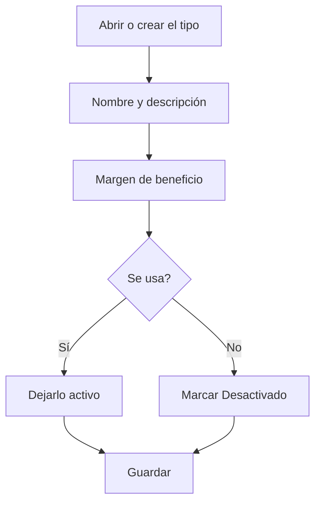

# Tipo de máquina

## Para qué sirve esta pantalla

Es la ficha de un tipo de máquina. Aquí se define el nombre con el que el tipo aparece en las máquinas y en las fases, y el margen de beneficio que se propone por defecto cuando una fase de una ruta o de una orden de fabricación se hace en este tipo de máquina. El título muestra «Alta de tipo de máquina» al crearlo y «Tipo de máquina: » seguido del nombre al editarlo.

## Acciones disponibles

- Escribir el «Nombre» y la «Descripción», que son obligatorios.
- Indicar el «Margen de beneficio», en porcentaje.
- Marcar o desmarcar «Desactivado».
- Guardar con «Guardar», en la cabecera de la pantalla. Al guardar, vuelves a la pantalla anterior.

## Flujo habitual

1. Desde «Gestión de tipos de máquina», pulsa «+» o abre un tipo existente.
2. Escribe un nombre corto y reconocible y una descripción.
3. Indica el margen de beneficio habitual para el trabajo de este tipo de máquina.
4. Pulsa «Guardar».
5. Asigna el tipo a las máquinas desde «Gestión de máquinas».

## Aspectos importantes

- El «Margen de beneficio» del tipo es el valor que se propone cuando eliges este tipo en «Tipo de máquina» en una fase de una ruta o de una orden de fabricación. Si después eliges una «Máquina preferida», la fase puede tomar el margen de la máquina. Cambiar el margen aquí no modifica las fases ya guardadas.
- Al crear un tipo, no se puede repetir el nombre de otro tipo.
- Un tipo marcado como «Desactivado» sigue en la lista, pero ya no se puede elegir en máquinas nuevas ni en fases. Las máquinas que ya lo tienen asignado no cambian.
- Para eliminar un tipo hay que hacerlo desde la lista; consulta la ayuda de «Gestión de tipos de máquina» antes de hacerlo, porque la eliminación es definitiva.

## Errores frecuentes

- Si aparece «El nombre es obligatorio» o «La descripción es obligatoria», rellena los dos campos antes de guardar.
- Si aparece «Tipo de centro de trabajo ... existente», ya hay un tipo con ese nombre: ábrelo desde la lista en lugar de crear otro.
- Si al guardar un nombre largo aparece un error, acórtalo: el nombre del tipo admite como máximo 50 caracteres.
- Si el tipo no aparece al crear una máquina o una fase, comprueba que no tenga marcado «Desactivado».

## Proceso básico

