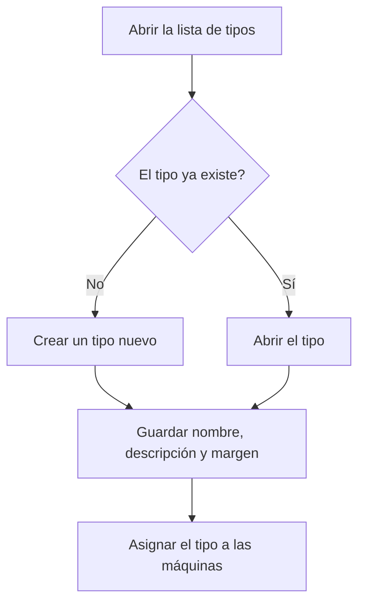

# Gestión de tipos de máquina

## Para qué sirve esta pantalla

Lista los tipos de máquina, la clasificación que agrupa las máquinas que pueden hacer el mismo trabajo. Cada máquina pertenece a un tipo, y las fases de las rutas de fabricación y de las órdenes de fabricación indican en qué tipo de máquina deben hacerse. Es el primer paso de la configuración de planta: tipo de máquina -> máquina -> costes por máquina -> fases de las rutas de fabricación.

## Acciones disponibles

- Crear un tipo nuevo con el botón «+» («Crear nuevo»).
- Abrir un tipo haciendo clic en su fila para cambiar el nombre, la descripción, el margen o el estado.
- Eliminar un tipo con el icono de la papelera («Eliminar») de la fila, tras confirmarlo.
- Consultar en la tabla el «Nombre», la «Descripción», el «% de beneficio» y si está «Desactivado».

## Flujo habitual

1. Revisa la lista para comprobar si el tipo ya existe.
2. Pulsa «+» para dar de alta un tipo nuevo.
3. Rellena el nombre, la descripción y el margen de beneficio, y guárdalo.
4. Ve a «Gestión de máquinas» y asigna este tipo a las máquinas que correspondan.
5. Cuando un tipo deje de usarse, ábrelo y márcalo como «Desactivado».

## Aspectos importantes

- La lista muestra todos los tipos, también los desactivados; la columna «Desactivado» lo indica. Esta pantalla no tiene filtros y la lista sale ordenada por nombre.
- Los tipos desactivados no se pueden elegir al crear una máquina desde «Gestión de máquinas» ni en el campo «Tipo de máquina» de las fases de rutas y órdenes de fabricación.
- La eliminación es definitiva: el tipo no se desactiva, se borra. Por eso no se puede eliminar un tipo que tenga máquinas o que se use en las fases de rutas o de órdenes de fabricación.
- Si el tipo ya se ha usado, desactívalo en lugar de eliminarlo.
- Los campos de la ficha y el papel del margen de beneficio se explican en la ayuda de la pantalla «Tipo de máquina».

## Errores frecuentes

- Si aparece «No se ha podido eliminar el tipo de máquina ...», el tipo tiene máquinas o alguna fase de una ruta o de una orden de fabricación lo usa: desactívalo en lugar de eliminarlo.
- Si un tipo no aparece al crear una máquina o una fase, comprueba que no esté marcado como «Desactivado».
- Si al crear un tipo aparece «Tipo de centro de trabajo ... existente», ya hay uno con el mismo nombre: ábrelo desde la lista.

## Proceso básico

