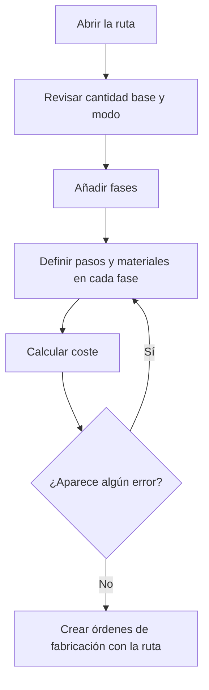

# Ruta de fabricación

## Para qué sirve esta pantalla

Es la ficha de una ruta de fabricación. Aquí se definen los datos generales de la ruta (referencia, cantidad base, volumen y modo), la lista de fases por las que pasa la pieza y los costes teóricos resultantes. Cuando se crea una orden de fabricación a partir de esta ruta, se copian en ella las fases, los pasos y los materiales.

Flujo: `ruta de fabricación -> fases -> pasos y materiales -> cálculo de coste -> orden de fabricación`.

## Acciones disponibles

- Modificar «Referencia», «Cantidad base», «Volumen mm3», «Modo» y «Desactivado», y guardar con «Guardar», en la cabecera.
- Recalcular los costes con «Calcular coste», en la flecha del botón «Guardar».
- Consultar los costes en el bloque «Costos»: «Coste de operario», «Coste de máquina», «Coste de material», «Coste externo», «Coste total» y «Peso total».
- Añadir una fase con el botón + de «Fases de la ruta»: se abre el diálogo «Nueva fase».
- Abrir una fase haciendo clic en la fila para definir sus pasos y sus materiales.
- Eliminar una fase con la cruz de la fila, tras confirmarlo.

## Flujo habitual

1. Abre la ruta desde «Gestión de rutas de fabricación» o desde la pestaña «Rutas de fabricación» de la referencia de venta.
2. Revisa la «Cantidad base» y el «Modo» y pulsa «Guardar».
3. Pulsa + en «Fases de la ruta», revisa el código propuesto, rellena el tipo de máquina, la máquina preferida y el tipo de operario, y pulsa «Guardar».
4. La fase se crea y se abre su ficha: añade los pasos y los materiales.
5. Repite el proceso para cada fase, volviendo a la ruta con el botón atrás.
6. Pulsa «Calcular coste» y revisa el resultado en el mensaje «Cálculo de coste» y en el bloque «Costos».

## Aspectos importantes

- Al añadir una fase, el código propuesto es la decena siguiente a la fase más alta (10, 20, 30...). No se puede crear una fase con un código que ya existe en la ruta.
- Los costes quedan guardados en la ruta. Se recalculan al pulsar «Guardar» o «Calcular coste» en esta pantalla; los cambios hechos en las fases, pasos o materiales no los actualizan hasta que vuelves a guardar o calcular aquí.
- «Guardar» recalcula sin avisar: si el cálculo no se puede hacer, la ruta se guarda igualmente pero los costes se quedan como estaban. Usa «Calcular coste» para ver el motivo.
- «Calcular coste» primero guarda la ruta y después muestra el coste total en un mensaje.
- Los costes se calculan para la «Cantidad base»:
  - «Coste de operario»: el «Tiempo de operario (min)» de cada paso, pasado a horas, por el «Coste/hora» del «Tipo de operario» de la fase.
  - «Coste de máquina»: el «Tiempo de máquina (min)» de cada paso, pasado a horas, por el coste que la «Máquina preferida» de la fase tiene para el estado del paso en «Costes por máquina».
  - Los pasos marcados como «Tiempo de ciclo» son tiempos por pieza y se multiplican por la cantidad base. El resto son un tiempo fijo para todo el lote.
  - «Coste de material»: para cada material, el «Último coste» de la referencia de compra por el peso calculado con las medidas y la densidad de su tipo de material, y por la cantidad. Si el formato del material es por unidades, es el «Último coste» por la cantidad. Los materiales sin formato no suman coste.
  - «Peso total»: la suma de los pesos calculados de los materiales.
  - «Coste externo»: la suma del «Coste de servicio» y el «Coste de transporte» de las fases externas. Las fases externas no suman coste de operario, de máquina ni de material.
- Al guardar la ruta, el coste total también se copia en el campo «Coste teórico de fabricación» de la referencia.
- Una ruta «Desactivado» no se ofrece para crear órdenes de fabricación ni en las líneas de presupuestos y pedidos, y no aparece en la pestaña «Rutas de fabricación» de la referencia.
- Al crear una orden de fabricación, se copian las fases, los pasos y los materiales de la ruta. Las cantidades de material se ajustan a la cantidad planificada en proporción a la «Cantidad base». Los cambios posteriores en la ruta no modifican las órdenes ya creadas.
- El «Volumen mm3» se usa para calcular el peso de las líneas de presupuesto que utilizan esta ruta.
- Eliminar una fase es definitivo: también se borran sus pasos y materiales.

## Errores frecuentes

- Si «Calcular coste» dice «No se ha encontrado la combinación de centro de trabajo y estado de máquina», revisa que cada fase interna con pasos tenga «Máquina preferida» y que esa máquina tenga coste para cada estado de los pasos en «Costes por máquina».
- Si dice «No se ha encontrado el tipo de material», algún material de las fases es una referencia de compra sin «Tipo de material».
- Si aparece un mensaje (en catalán) que pide medidas o densidad superiores a 0 para calcular placas, redondos o tubos, completa las medidas del material en la pestaña «Materiales» de la fase y la densidad del tipo de material.
- Si al añadir una fase aparece «Fase no válida» porque la fase ya existe, cambia el código de la fase.
- Si aparece «La cantidad base debe ser superior a 0», la «Cantidad base» debe ser 1 o más.
- Si el «Coste de operario» sale a 0, comprueba que las fases tengan «Tipo de operario» y que los pasos tengan tiempo de operario.

## Proceso básico

