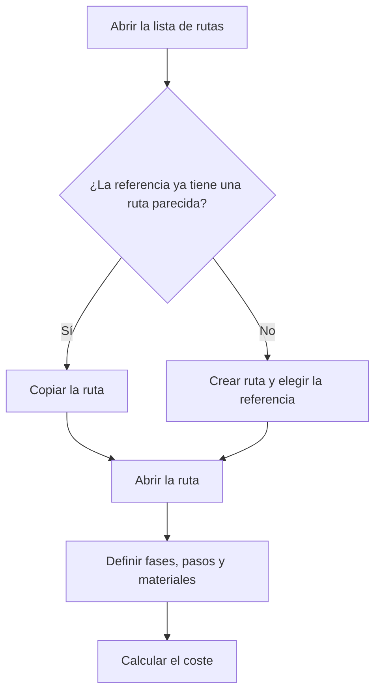

# Gestión de rutas de fabricación

## Para qué sirve esta pantalla

Lista todas las rutas de fabricación. Una ruta define cómo se fabrica una referencia de venta: las fases, los pasos de cada fase con sus tiempos, los materiales que se consumen y el coste teórico resultante. Las órdenes de fabricación se crean a partir de una ruta, y los presupuestos y los pedidos de venta también la utilizan.

Flujo: `referencia de venta -> ruta de fabricación -> orden de fabricación -> fases -> declaración de piezas`.

## Acciones disponibles

- Crear una ruta nueva con el botón «Nuevo» (+): se abre el diálogo «Crear ruta», donde solo hay que elegir la «Referencia».
- Abrir una ruta haciendo clic en la fila para editar sus datos, sus fases y sus costes.
- Copiar una ruta con el icono de copia de la fila (o «Copiar» en la vista de tarjetas del móvil): se abre el diálogo «Copiar ruta de fabricación».
- Eliminar una ruta con la cruz de la fila, tras confirmarlo.
- Filtrar la lista en «Filtros» por «Cliente», «Referencia» y «Última actualización» (rango de fechas), y quitar los filtros con «Limpiar».

## Flujo habitual

1. Filtra por «Cliente» o «Referencia» para encontrar la ruta que buscas.
2. Si la referencia todavía no tiene ruta, pulsa «Nuevo», elige la «Referencia» y pulsa «Guardar».
3. La ruta se crea y se abre directamente para que le añadas las fases.
4. Si una referencia nueva se fabrica igual que otra, usa el icono de copia en lugar de empezar de cero.
5. En el diálogo de copia, elige el «Destino de la copia», el «Modo de fabricación» y pulsa «Guardar».

## Aspectos importantes

- Una ruta nueva se crea con cantidad base 1 y modo «Prototip». Estos valores y el resto de datos se cambian en la ficha de la ruta.
- Una misma referencia puede tener varias rutas, por ejemplo una por modo: «Prototip», «Sèrie curta» y «Sèrie llarga» (los modos se muestran con estos nombres en todos los idiomas).
- La columna «Coste» es la suma de los costes de operario, máquina, material y externo calculados en la ficha de la ruta. No se recalcula desde esta lista.
- La copia duplica todas las fases, pasos y materiales de la ruta de origen, y también sus costes.
  - Con «Referencia existente», la ruta nueva se asigna a la referencia elegida.
  - Con «Crear nueva referencia», se crea una referencia nueva con el «Código» indicado, que copia todos los datos de la referencia de origen. Si dejas la «Descripción» en blanco, se usa la del origen.
- Al terminar la copia, la lista se refresca pero no se abre la ruta nueva.
- El filtro «Cliente» también muestra las rutas de referencias que no tienen ningún cliente asignado. Con un cliente elegido, el desplegable «Referencia» solo ofrece sus referencias.
- Los filtros se recuerdan cuando sales de la pantalla y vuelves.
- La columna «Desactivada» indica las rutas que ya no se pueden elegir para crear órdenes de fabricación ni en las líneas de presupuestos y pedidos. Aquí siguen apareciendo.
- La eliminación es definitiva: se borra la ruta con todas sus fases, pasos y materiales. No se puede eliminar una ruta que ya se ha usado en órdenes de fabricación, presupuestos o pedidos: márcala como «Desactivado» en su ficha.

## Errores frecuentes

- Si la copia a una «Referencia existente» dice «Referencia con ruta de fabricación del modo seleccionado. Seleccione otro modo», esa referencia ya tiene una ruta con el mismo modo: elige otro «Modo de fabricación».
- Si la copia no avanza y aparece «Selecciona una referencia de destino» o «Introduce el código de la nueva referencia», falta el campo obligatorio de la opción de destino elegida.
- Si al crear una ruta aparece «La referencia es obligatoria», elige una referencia antes de guardar.
- Si no encuentras una ruta, revisa los filtros activos, sobre todo el rango de «Última actualización», y pulsa «Limpiar».

## Proceso básico

