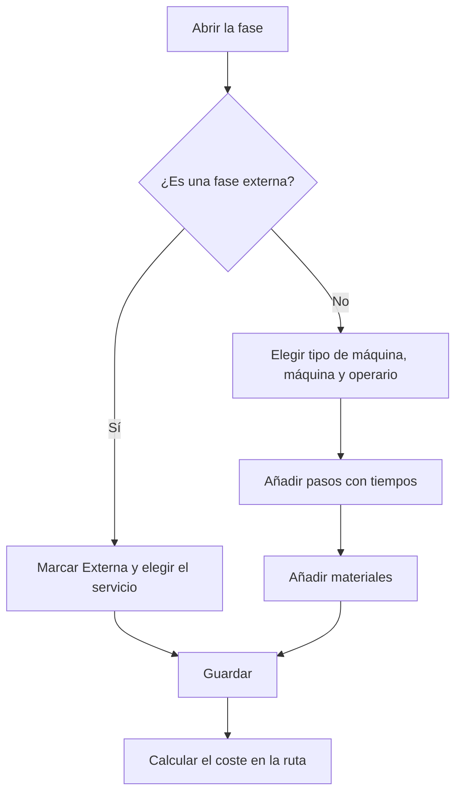

# Ruta de fabricación - Fase

## Para qué sirve esta pantalla

Es la ficha de una fase de una ruta de fabricación. Define dónde se hace la fase (tipo de máquina y máquina preferida), quién la hace (tipo de operario), el margen de beneficio, si es un trabajo externo, los pasos con sus tiempos y los materiales que consume. Estos datos alimentan el cálculo de coste de la ruta y se copian en las fases de las órdenes de fabricación que se crean con la ruta.

Flujo: `ruta de fabricación -> fase -> pasos y materiales -> orden de fabricación -> carga en la máquina`.

## Acciones disponibles

- Modificar la cabecera de la fase: «Código de la fase», «Descripción», «Tipo de máquina», «Máquina preferida», «Margen de beneficio», «Tipo de operario», «Externa», «Servicio», «Coste de servicio» y «Coste de transporte», y guardar con «Guardar».
- Gestionar los pasos en la pestaña «Pasos»: + para añadir uno («Añadir paso de fabricación»), clic en la fila para modificarlo y cruz para eliminarlo.
- Gestionar los materiales en la pestaña «Materiales»: + para añadir uno («Añadir material»), clic en la fila para modificarlo y cruz para eliminarlo.

## Flujo habitual

1. Abre la fase desde «Fases de la ruta» (también se abre sola justo después de crearla).
2. Elige el «Tipo de máquina», después la «Máquina preferida», revisa el «Margen de beneficio», elige el «Tipo de operario» y pulsa «Guardar».
3. En «Pasos», pulsa + y rellena «Orden», «Estado», «Tiempo de ciclo», «Tiempo de máquina (min)», «Tiempo de operario (min)» y, si hace falta, «Comentario de fabricación». Repite para cada paso.
4. En «Materiales», pulsa + y elige el «Material», la «Cantidad» y las medidas que pide su formato.
5. Vuelve a la ruta y pulsa «Calcular coste» para actualizar sus costes.

## Aspectos importantes

- Al cambiar el «Tipo de máquina», se vacía la «Máquina preferida» y se propone el margen del tipo de máquina. La «Máquina preferida» solo ofrece máquinas de ese tipo.
- Al elegir la «Máquina preferida», el «Margen de beneficio» se propone así: si la máquina tiene porcentajes en su pestaña «Porcentajes», el campo pasa a ser un desplegable con esos valores; si no, se usa el margen de la máquina y, si es 0, el del tipo de máquina. En el resto de casos el campo es de solo lectura.
- El «Margen de beneficio» es el margen que se propone para esta fase cuando la ruta se usa en una línea de presupuesto o de pedido.
- Al marcar «Externa», se vacían el tipo de máquina, la máquina preferida y el tipo de operario, y se propone el margen para trabajos externos del ejercicio vigente. Se activan «Servicio», «Coste de servicio» y «Coste de transporte». Al desmarcarla, estos tres campos y el margen vuelven a cero.
- «Servicio» ofrece las referencias de compra de tipo servicio. Al elegir una, «Coste de servicio» y «Coste de transporte» se rellenan con el precio y el transporte del servicio.
- En una fase externa, el coste de la ruta solo cuenta el «Coste de servicio» y el «Coste de transporte»: los pasos y los materiales de la fase no suman coste. Si la fase tiene un «Servicio», los presupuestos que usan la ruta añaden ese servicio externo.
- El orden de un paso nuevo se propone como la decena siguiente (10, 20, 30...).
- Cada paso es un estado de máquina con un tiempo previsto. En planta, los pasos de la fase de la orden de fabricación son las actividades que el operario puede cargar en la máquina, y sus tiempos se comparan con los reales.
- Con «Tiempo de ciclo» marcado, los tiempos del paso son por pieza y se multiplican por la cantidad. Sin marcar, son un tiempo fijo para todo el lote.
- Al guardar un paso, se comprueba que todas las máquinas del «Tipo de máquina» de la fase tengan un coste para el estado elegido en «Costes por máquina».
- El desplegable «Material» ofrece referencias de compra. La «Cantidad» corresponde a la cantidad base de la ruta; al crear una orden de fabricación se ajusta a la cantidad planificada.
- Las medidas necesarias dependen del formato del material: una placa necesita anchura, altura y longitud; un redondo, diámetro y longitud; un tubo, diámetro, grosor y longitud. Un material por unidades no necesita medidas. Además, el tipo de material debe tener densidad.
- Cuando añades, modificas o eliminas un paso o un material, también se guardan los cambios pendientes de la cabecera de la fase.
- Los cambios de esta pantalla no actualizan los costes de la ruta hasta que vuelves a guardar o calcular en la ruta.
- Al cambiar el «Código de la fase» desde aquí, no se comprueba si ya existe en la ruta: evita repetir códigos.
- Eliminar un paso o un material es definitivo.

## Errores frecuentes

- Si al guardar un paso aparece «No se ha encontrado el costo del centro de trabajo», alguna máquina del tipo de máquina de la fase no tiene coste para ese estado: añádelo en «Costes por máquina» o elige otro estado.
- Si la «Máquina preferida» aparece vacía, elige primero el «Tipo de máquina».
- Si «Servicio», «Coste de servicio» y «Coste de transporte» no se pueden editar, marca «Externa».
- Si el paso no se guarda, revisa los mensajes «El orden es obligatorio», «El orden debe ser positivo» o «El tiempo estimado es obligatorio».
- Si el material no se guarda, revisa «El material de consumo es obligatorio» o «La cantidad que consumir debe ser positiva»: la cantidad debe ser 1 o más.
- Si después el cálculo de coste de la ruta falla por medidas o densidad, completa aquí las medidas del material según su formato.

## Proceso básico

