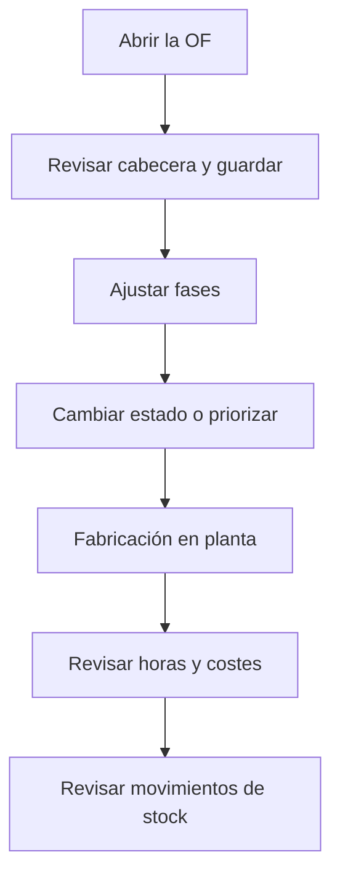

# Orden de fabricación

## Para qué sirve esta pantalla

Es la ficha de una orden de fabricación (OF). La cabecera recoge la referencia, la cantidad y la fecha previstas, el estado, la prioridad y el período de ejecución. Las pestañas muestran las fases que hay que hacer, las horas declaradas en tickets de producción, los costes acumulados y los movimientos de stock de la OF. Se sitúa entre la ruta de fabricación (de donde salen las fases) y la planta, donde se fabrican las fases.

## Acciones disponibles

- Guardar la cabecera con «Guardar».
- Descargar la hoja de la OF con la flecha de «Guardar»: «Descargar Excel» o «Descargar PDF».
- Cambiar el estado de la OF desde el campo «Estado».
- Pestaña «Fases»: añadir una fase con el botón «+» (diálogo «Nueva fase»), abrir una fase haciendo clic en la fila y eliminarla con la cruz.
- Pestaña «Horas»: consultar los tickets de producción de la OF, filtrarlos por operario, máquina, fase o fecha, añadir uno con «+» (diálogo «Crear ticket de producción») y eliminarlo con la cruz.
- Pestaña «Costes»: consultar «Coste operario», «Coste máquina», «Coste de material», «Coste total», «Tiempo de operario» y «Tiempo de máquina».
- Pestaña «Movimientos»: consultar los movimientos de stock de la OF (fecha, referencia, ubicación, dimensiones, tipo, cantidad y descripción).

## Flujo habitual

1. Abre la OF desde «Órdenes de fabricación» o desde la línea del pedido de venta.
2. Revisa la «Fecha prevista», la «Cantidad prevista» y la «Prioridad», y pulsa «Guardar».
3. En «Fases», revisa las fases copiadas de la ruta; añade alguna o abre una para ajustar pasos y materiales.
4. Cambia el «Estado» cuando la OF esté lista para planta, o priorízala desde «Priorizar órdenes de fabricación».
5. Mientras se fabrica, sigue el progreso en «Fases» (piezas buenas / malas) y en «Horas».
6. Al terminar, revisa «Costes» y «Movimientos» para validar el coste real y la entrada de stock.

## Aspectos importantes

- «Código», «Referencia» y «Cantidad total» no se pueden editar. La «Cantidad total» suma las piezas de los tickets de producción y, cuando se finaliza la última fase en planta, pasa a ser las piezas buenas de esa fase.
- El desplegable «Estado» solo ofrece los estados a los que se puede pasar desde el actual, según las transiciones definidas en «Ciclos de vida».
- Cambiar el estado desde esta ficha no genera tickets ni movimientos de stock. Esos efectos se producen al finalizar fases en planta.
- La planta actualiza la OF automáticamente: al empezar una fase, la OF pasa a «Producció» y se anota el inicio del «Período de ejecución»; al finalizar la última fase, la OF toma el estado elegido, se anota el final y se crea una única entrada de stock de producción con las piezas buenas en la ubicación por defecto del almacén. Si la fase siguiente es externa, la OF pasa a «Servei Extern».
- Una fase externa se cierra sola cuando se recibe todo el pedido de compra de su servicio; si no es la última, la OF pasa a «Pausa», y si lo es, la OF queda «Tancada» con su entrada de stock.
- Los nombres de estado se muestran tal como están definidos en «Ciclos de vida».
- Los costes de operario y de máquina se acumulan con cada ticket de producción (tiempo en minutos × coste por hora / 60). El coste de material se recalcula a partir de los consumos de stock de las fases al finalizar una fase en planta.
- Al guardar la OF, el «Coste total» se copia al «Coste Última Fabricación / Compra» de la referencia y al último coste de las líneas de pedido de venta vinculadas.
- Si cambias la «Cantidad prevista», las cantidades de materiales de las fases no se recalculan: revísalas en cada fase.
- En «Horas», la cruz elimina el ticket al instante, sin confirmación, y descuenta sus horas, piezas y costes de la OF.
- Eliminar una fase (con confirmación) también elimina sus pasos, materiales, rechazos y tickets de producción.
- Al crear un ticket desde esta ficha, primero eliges «Orden de fabricación | Fase | Actividad» y después la «Máquina»: solo aparecen las máquinas del tipo de máquina de la fase.
- Una fase nueva propone como código la decena siguiente (10, 20, 30...) y el estado inicial del ciclo de vida. Al guardarla se abre su ficha.

## Errores frecuentes

- Si no puedes guardar, revisa los avisos «La fecha prevista es obligatoria», «La cantidad debe ser superior a 0» y «El orden es obligatorio» (campo «Prioridad»).
- Si el estado que buscas no aparece en el desplegable, comprueba las transiciones del estado actual en «Ciclos de vida».
- Si aparece «Fase no válida» al añadir una fase, el código ya existe en esta OF: cámbialo.
- Si al crear un ticket aparece «Debes introducir el tiempo de máquina y debe ser mayor que 0», informa el «Tiempo total del centro de trabajo (minutos)».
- Si al crear un ticket no hay máquinas para elegir, la fase no tiene tipo de máquina o no hay máquinas de ese tipo.
- Si un ticket sale con coste de máquina 0, comprueba en «Costes por máquina» que la máquina tenga coste para el estado de máquina del paso.
- Si la descarga muestra «No se ha podido generar el informe de la orden de fabricación», vuelve a intentarlo y, si persiste, avisa al administrador.

## Proceso básico

