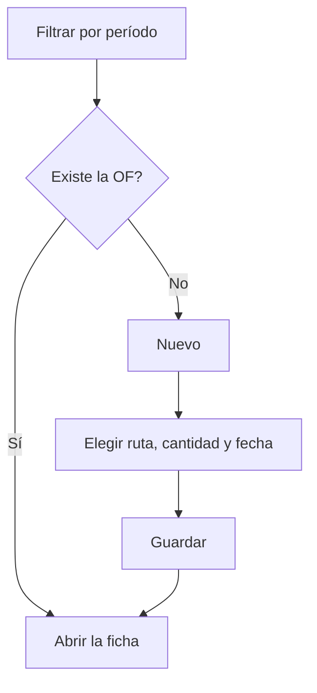

# Órdenes de fabricación

## Para qué sirve esta pantalla

Es la lista de todas las órdenes de fabricación (OF). Desde aquí se buscan las OF de un período, se crea una OF nueva a partir de una ruta de fabricación y se abre la ficha de cada orden. Encaja en el flujo `ruta de fabricación -> orden de fabricación -> fases -> tickets de producción`. Las OF también se pueden crear desde una línea de pedido de venta.

## Acciones disponibles

- Filtrar la lista con «Filtros»: «Período», «Cliente», «Código» y «Estado», y aplicarlos con «Filtrar».
- Volver a los filtros iniciales con «Limpiar».
- Crear una OF nueva con «Nuevo», que abre el diálogo «Crear orden».
- Abrir la ficha de una OF haciendo clic en la fila.
- Eliminar una OF con la cruz de la fila, después de confirmarlo.
- Ordenar por «Fecha prevista» y ajustar la vista con «Configuración de la vista».

## Flujo habitual

1. Revisa el «Período» del filtro: por defecto es el ejercicio del año en curso.
2. Filtra por «Cliente», «Código» o «Estado» si hace falta y pulsa «Filtrar».
3. Para crear una OF, pulsa «Nuevo».
4. Elige la «Ruta», informa la «Cantidad», la «Fecha prevista» y, si quieres, el «Comentario de fabricación».
5. Guarda: se abre directamente la ficha de la nueva OF.
6. Desde la ficha revisa fases, materiales y prioridad antes de lanzarla a planta.

## Aspectos importantes

- El «Período» es obligatorio y filtra por la fecha prevista de la OF, no por la fecha de creación.
- Los filtros se guardan por usuario al salir de la pantalla; «Limpiar» los borra y vuelve al ejercicio del año en curso.
- En el diálogo de creación solo aparecen las rutas de fabricación activas. Cada opción muestra la referencia, la cantidad base de la ruta y el modo.
- Al crear la OF, el código se genera automáticamente con el contador del ejercicio que corresponde a la «Fecha prevista».
- La OF nace en el estado inicial del ciclo de vida de las órdenes de fabricación («Creada») y copia las fases, los pasos y los materiales de la ruta. La cantidad de cada material se escala según la cantidad de la OF respecto a la cantidad base de la ruta. Los nombres de estado se muestran tal como están definidos en «Ciclos de vida».
- Los cambios posteriores en la ruta no modifican las OF ya creadas.
- Si la referencia de la ruta trabaja con lotes, aparece el campo «Código de lote». Según la configuración del sistema, el lote toma automáticamente el código de la OF (y el campo se ignora) o bien hay que informarlo.
- Desde una línea de pedido de venta, el mismo diálogo aparece con la ruta, la cantidad de la línea y la fecha prevista del pedido propuestas, y la línea queda vinculada a la OF.
- La eliminación es definitiva: borra la OF con sus fases y tickets de producción, y desvincula la línea de pedido de venta asociada.

## Errores frecuentes

- Si aparece «Filtro no válido», selecciona un período completo (fecha de inicio y de fin).
- Si no puedes guardar el diálogo, revisa los avisos: «La ruta de fabricación es obligatoria», «La cantidad debe ser superior a 0» o «La fecha prevista es obligatoria».
- Si la creación falla indicando que no se ha encontrado ningún ejercicio, comprueba en «Ejercicios» que haya uno que cubra la «Fecha prevista».
- Si pide un código de lote, informa el «Código de lote»: la referencia trabaja con lotes y el sistema no lo genera automáticamente.
- Si una ruta no aparece en la lista, comprueba en «Gestión de rutas de fabricación» que esté activa.
- Si no puedes eliminar una OF que ya se ha trabajado en planta, es posible que tenga registros de planta o documentos vinculados que lo impidan.

## Proceso básico

