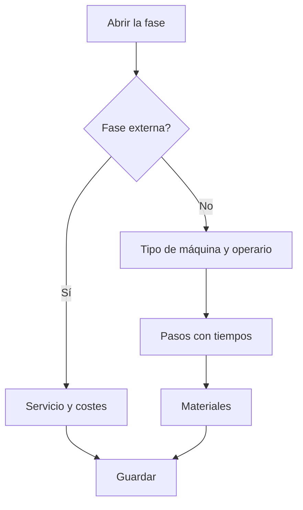

# Orden de fabricación - Fase

## Para qué sirve esta pantalla

Es la ficha de una fase de una orden de fabricación (OF). Define dónde y cómo se hace la fase (tipo de máquina, máquina preferida, tipo de operario o servicio externo), los pasos con los tiempos estimados por estado de máquina y los materiales que consume. También muestra los comentarios y los rechazos registrados en planta. Las fases se copian de la ruta de fabricación al crear la OF y se pueden ajustar aquí para esta orden.

## Acciones disponibles

- Guardar la cabecera de la fase con «Guardar».
- Cambiar el estado de la fase desde el campo «Estado».
- Pestaña «Pasos»: añadir un paso con «+» («Añadir paso de fabricación»), modificarlo haciendo clic en la fila («Modificar paso de fabricación») y eliminarlo con la cruz.
- Pestaña «Materiales»: añadir un material con «+» («Añadir material»), modificarlo haciendo clic en la fila y eliminarlo con la cruz.
- Pestaña «Comentarios»: leer el «Comentario de fase» escrito en planta.
- Pestaña «Rechazos»: consultar las piezas rechazadas por motivo, con el total de unidades rechazadas.

## Flujo habitual

1. Abre la fase desde la pestaña «Fases» de la OF.
2. Revisa el «Tipo de máquina», la «Máquina preferida», el «Margen de beneficio» y el «Tipo de operario», o marca «Externa» si la fase la hace un proveedor.
3. En «Pasos», comprueba que haya un paso para cada estado de máquina que se vaya a usar (por ejemplo preparación y producción) con los tiempos estimados.
4. En «Materiales», ajusta el material y la cantidad que se consumirá.
5. Pulsa «Guardar».
6. Durante y después de la fabricación, consulta «Comentarios» y «Rechazos».

## Aspectos importantes

- El «Tipo de máquina» decide en qué máquinas se puede cargar la fase en planta y qué máquinas se pueden elegir en un ticket de producción.
- Al cambiar el «Tipo de máquina», la «Máquina preferida» se vacía y el «Margen de beneficio» toma el del tipo. Al elegir una máquina preferida, el margen toma el de la máquina si tiene; si no, el del tipo.
- Marcar «Externa» vacía el tipo de máquina, la máquina preferida y el tipo de operario, y activa «Servicio», «Coste de servicio» y «Coste de transporte». Al elegir el servicio se copian su precio y el coste de transporte. Desmarcarla pone esos costes a cero.
- Las fases externas con servicio se pueden pasar a pedido de compra desde «Generación de pedidos de compra». Cuando se recibe todo el pedido, la fase se cierra automáticamente.
- El estado de la fase sigue el mismo ciclo de vida que la OF, y el desplegable solo ofrece las transiciones permitidas desde el estado actual. Normalmente la planta cambia el estado al cargar y finalizar la fase.
- Cada paso corresponde a un estado de máquina. Si «Tiempo de ciclo» está marcado, el tiempo de máquina es por pieza y se multiplica por la cantidad de la OF; si no, es el tiempo total del paso.
- Al finalizar la fase en planta, el tiempo trabajado se convierte en tickets de producción para cada estado de máquina que tenga un paso en la fase. El tiempo de estados sin paso no genera ticket.
- Un paso nuevo propone como orden la decena siguiente; el orden debe ser positivo.
- Añadir, modificar o eliminar un paso o un material también guarda los cambios que tengas pendientes en la cabecera de la fase.
- «Comentarios» y «Rechazos» son de solo lectura: se registran desde la máquina de planta.

## Errores frecuentes

- Si no puedes guardar la cabecera, revisa «El código es obligatorio» y «El estado es obligatorio».
- Si no puedes guardar un paso, revisa «El orden es obligatorio», «El orden debe ser positivo» y «El tiempo estimado es obligatorio».
- Si no puedes guardar un material, revisa «El material de consumo es obligatorio» y «La cantidad que consumir debe ser positiva».
- Si «Servicio», «Coste de servicio» o «Coste de transporte» aparecen desactivados, marca primero «Externa».
- Si la «Máquina preferida» no tiene opciones, elige antes un «Tipo de máquina».
- Si la fase no aparece en planta, comprueba el «Tipo de máquina» de la fase y el estado de la OF.

## Proceso básico

