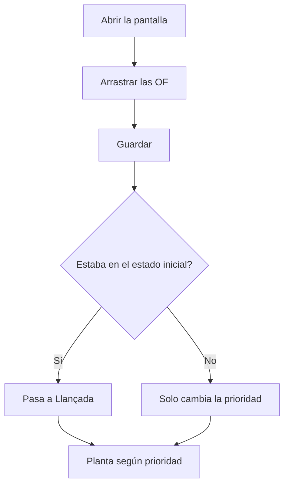

# Priorizar órdenes de fabricación

## Para qué sirve esta pantalla

Permite decidir en qué orden se deben fabricar las órdenes de fabricación (OF) pendientes. Arrastrando las filas se fija la «Prioridad» de cada OF, que es el orden en que la planta las ve en «Fases disponibles». También sirve para lanzar las OF recién creadas.

## Acciones disponibles

- Arrastrar una fila por el asa de la izquierda para cambiar su posición.
- Guardar el nuevo orden con el botón de guardar (icono de disquete) de la barra superior de la tabla.
- Abrir una OF haciendo clic en su «Código».

## Flujo habitual

1. Abre la pantalla: las OF aparecen ordenadas por «Prioridad» y, después, por «Fecha prevista».
2. Arrastra las OF hasta el orden en que se deben fabricar.
3. Pulsa el botón de guardar.
4. Comprueba el aviso «Órdenes de fabricación actualizadas».
5. Si hace falta, abre una OF desde el «Código» para revisarla.

## Aspectos importantes

- Solo aparecen las OF en estados marcados con la etiqueta «Available» del ciclo de vida de las órdenes de fabricación, en «Ciclos de vida». Si ningún estado tiene esa etiqueta, solo aparecen las OF en el estado inicial.
- Al arrastrar, la «Prioridad» se renumera 1, 2, 3... según la posición en la lista. No se guarda nada hasta que pulsas el botón de guardar.
- Al guardar, las OF que estaban en el estado inicial del ciclo de vida (normalmente «Creada») pasan a «Llançada». Las demás solo cambian de prioridad. Los nombres de estado se muestran tal como están definidos en «Ciclos de vida».
- La planta muestra las OF en «Fases disponibles» por prioridad y después por fecha prevista, siempre que el estado de la OF tenga la etiqueta «Plant».
- La prioridad también se puede cambiar a mano desde el campo «Prioridad» de la ficha de la OF.
- Esta pantalla no tiene filtros ni permite crear o eliminar OF: para ello usa «Órdenes de fabricación».

## Errores frecuentes

- Si una OF no aparece en la lista, comprueba su estado y que ese estado tenga la etiqueta «Available» en «Ciclos de vida».
- Si al guardar aparece un error, vuelve a cargar la pantalla y repite la ordenación: una de las OF puede haberse eliminado mientras tanto.
- Si una OF priorizada no aparece en planta, comprueba que su estado tenga la etiqueta «Plant».
- Si sales sin guardar, el nuevo orden se pierde.

## Proceso básico

