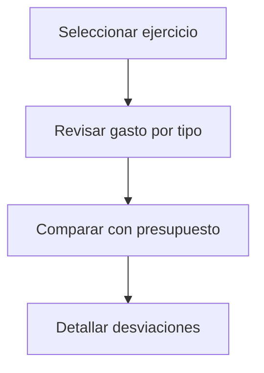

# Cuadro de gastos

## Para qué sirve esta pantalla

El cuadro de gastos es una vista de síntesis que muestra el gasto acumulado del ejercicio activo desglosado por tipo de gasto. Permite visualizar rápidamente el total de cada categoría, comparar con presupuestos y detectar desviaciones.

## Acciones disponibles

- Seleccionar ejercicio
- Filtrar por tipo de gasto
- Revisar totales por categoría
- Comparar con presupuesto

## Flujo habitual

1. Selecciona el ejercicio activo.
2. Revisa el resumen de gastos por tipo.
3. Compara con los presupuestos establecidos.
4. Detalla por categoría si observas desviaciones significativas.

## Aspectos importantes

- El comportamiento concreto de cada acción depende del estado del ciclo de vida de la entidad.
- Las acciones de creación, modificación y eliminación pueden estar bloqueadas según el estado.
- Algunos campos son de solo lectura cuando la entidad ya forma parte de un documento comercial vinculado.

## Errores frecuentes

- Si el cuadro no muestra datos, comprueba que el ejercicio seleccionado tenga gastos registrados.

## Proceso básico

