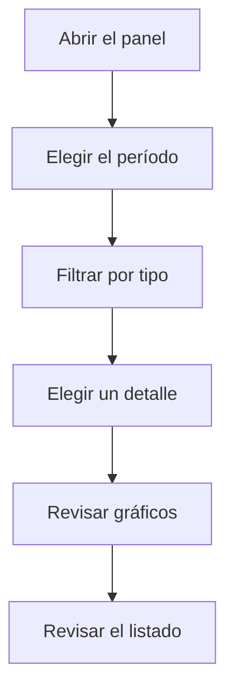

# Panel de gastos

## Para qué sirve esta pantalla

Resume todo lo que la empresa tiene que pagar en un período, sumando dos fuentes: los gastos de «Gestión de gastos» (por fecha de pago) y los vencimientos de las facturas de compra (por fecha de vencimiento). Muestra el importe total, la evolución por meses y el reparto por tipo de gasto o por proveedor, y da el detalle en una lista.

## Acciones disponibles

- Elegir el «Período»; por defecto es el año en curso.
- Filtrar por «Tipo»: «Compra» (vencimientos de facturas de compra) o «Gasto» (gastos generales).
- Filtrar por «Detalle»: un tipo de gasto o un proveedor concreto, entre los que aparecen en el gráfico por tipología.
- Consultar la pestaña «Gráficos»: «Gastos agrupados mensualmente» (barras por mes) y «Gráfico de gastos por tipología» (tarta).
- Consultar la pestaña «Listado»: una fila por cada gasto o vencimiento, con tipo, detalle, fecha de pago, importe y descripción.
- Limpiar los filtros con el botón «Limpiar filtros» de la barra de filtros.

## Flujo habitual

1. Abre «Panel de gastos» y revisa el «Gasto total» del año en curso.
2. Ajusta el «Período» si quieres otro intervalo; el panel se actualiza solo al elegir las dos fechas.
3. Elige en «Tipo» si quieres ver solo compras o solo gastos.
4. Mira en el gráfico por tipología qué tipos de gasto o proveedores pesan más y, si hace falta, elige uno en «Detalle».
5. Pasa a «Listado» para ver las partidas concretas que forman el total.

## Aspectos importantes

- «Gasto total» es la suma de los importes de todas las partidas que cumplen los filtros, las mismas que aparecen en «Listado».
- En las compras, el importe es el de cada vencimiento de la factura y la fecha es la de vencimiento, no la de la factura. Se cuentan todas las facturas de compra, sea cual sea su estado.
- En «Detalle», las compras se agrupan por el nombre fiscal del proveedor y los gastos por el nombre del tipo de gasto.
- Los gastos recurrentes aparecen una vez por cada pago generado.
- Si registras como gasto un pago que también entra como factura de compra, el panel lo contará dos veces.
- Cambiar el «Tipo» vacía el filtro «Detalle». Las opciones de «Detalle» son las etiquetas que muestra en ese momento el gráfico por tipología.
- Este panel es de consulta: no crea ni modifica nada.

## Errores frecuentes

- Si el panel no cambia al elegir el período, comprueba que hayas marcado la fecha de inicio y la de fin.
- Si después de limpiar los filtros los gráficos no cambian, vuelve a elegir un «Período»: sin período no se recargan los datos.
- Si una factura de compra no aparece, comprueba que tenga vencimientos y que la fecha de vencimiento esté dentro del período.
- Si un gasto no aparece, comprueba su fecha de pago en «Gestión de gastos».

## Proceso básico

```mermaid
flowchart TD
    A[Abrir el panel] --> B[Elegir el período]
    B --> C[Filtrar por tipo]
    C --> D[Elegir un detalle]
    D --> E[Revisar gráficos]
    E --> F[Revisar el listado]
```
