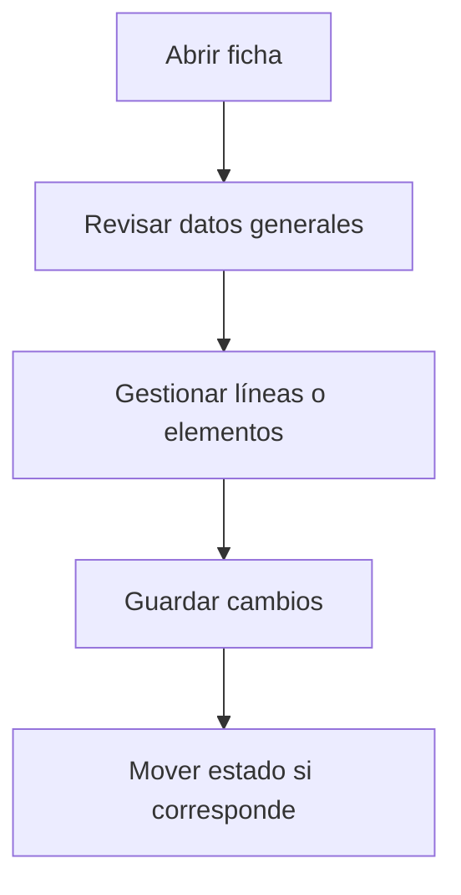

# Gasto

## Para qué sirve esta pantalla

Pantalla de gestión de la entidad.

## Acciones disponibles

- Guardar el gasto
- Modificar importes y fechas
- Marcar como pagada / impagada
- Eliminar el gasto

## Flujo habitual

1. Revisa los datos generales de la ficha.
2. Gestiona las líneas o los elementos asociados según corresponda.
3. Guarda los cambios cuando hayáis terminado.
4. Si la ficha tiene un ciclo de vida, mueve el estado según corresponda.

## Aspectos importantes

- El comportamiento concreto de cada acción depende del estado del ciclo de vida de la entidad.
- Las acciones de creación, modificación y eliminación pueden estar bloqueadas según el estado.
- Algunos campos son de solo lectura cuando la entidad ya forma parte de un documento comercial vinculado.

## Errores frecuentes

- Si no se puede guardar, comprueba que el tipo, el importe y las fechas estén informados.
- Si el gasto no se puede eliminar, comprueba que no esté ya pagado.

## Proceso básico

