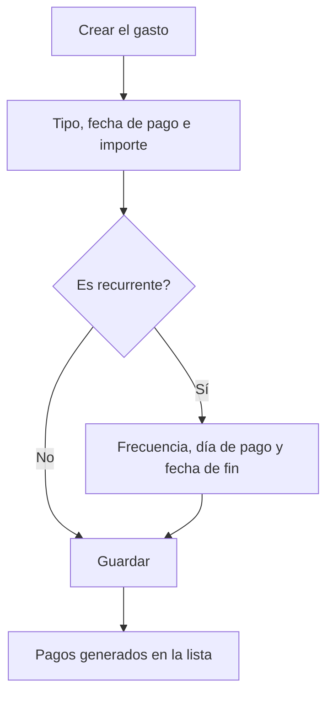

# Gasto

## Para qué sirve esta pantalla

Es la ficha de un gasto general: un pago que la empresa registra fuera de las facturas de compra, clasificado por tipo. Se abre al crear un gasto desde «Gestión de gastos» («Alta de gasto») o al abrir uno existente («Modificación de gasto»). Si el gasto se repite, aquí mismo defines cada cuánto y hasta cuándo, y la aplicación genera los pagos futuros.

## Acciones disponibles

- Elegir el «Tipo» de gasto e informar la «Fecha de alta», la «Fecha de pago» y el «Importe».
- Marcar «Recurrente» para activar «Frecuencia», «Día de pago» y «Fecha de fin».
- Escribir una «Descripción».
- Guardar con «Guardar», en la cabecera de la pantalla.

## Flujo habitual

1. Desde «Gestión de gastos», pulsa «+».
2. Elige el «Tipo» e informa la «Fecha de pago» y el «Importe».
3. Si es un pago periódico, marca «Recurrente» y elige la «Frecuencia» (mensual, bimensual, trimestral, semestral o anual), el «Día de pago» y la «Fecha de fin».
4. Añade una «Descripción» que identifique el pago.
5. Pulsa «Guardar»: vuelves a la lista, donde ya aparecen el gasto y, si es recurrente, los pagos generados.

## Aspectos importantes

- «Tipo», «Fecha de alta», «Fecha de pago» e «Importe» son obligatorios. Los tipos se mantienen en «Gestión de tipos de gasto».
- La «Fecha de pago» es la que cuenta en la lista y en el «Panel de gastos».
- Al crear un gasto recurrente, la aplicación genera un pago nuevo por cada período de la «Frecuencia», con el mismo tipo, importe y descripción, hasta la «Fecha de fin», incluida. Ningún pago generado pasa de la fecha de fin.
- Los pagos generados caen siempre el «Día de pago» de cada mes. Si el mes tiene menos días (por ejemplo, el día 31 en febrero), se usa el último día del mes.
- Al modificar un gasto recurrente, se guarda el gasto que editas y se vuelven a generar, con los datos nuevos, los pagos posteriores a su fecha de pago. Los pagos anteriores no cambian. Para cambiar toda la serie, edita el primer pago.
- Eliminar un gasto recurrente, desde la lista, elimina toda la serie.

## Errores frecuentes

- Si «Guardar» no hace nada, revisa los mensajes en rojo: falta el tipo, alguna fecha o el importe.
- Si el desplegable «Tipo» sale vacío, vuelve a «Gestión de gastos» y abre el gasto desde la lista, que es la que carga los tipos.
- Si has marcado «Recurrente», el formulario exige la «Frecuencia», un «Día de pago» entre 1 y 31 y una «Fecha de fin» posterior a la «Fecha de pago». Revisa los mensajes en rojo de esos campos.
- Si después de modificar un gasto recurrente los pagos anteriores no han cambiado, es el comportamiento esperado: solo se regeneran los posteriores. Edita el primer pago de la serie para cambiarlos todos.

## Proceso básico

```mermaid
flowchart TD
    A[Crear el gasto] --> B[Tipo, fecha de pago e importe]
    B --> C{Es recurrente?}
    C -->|No| E[Guardar]
    C -->|Sí| D[Frecuencia, día de pago y fecha de fin]
    D --> E
    E --> F[Pagos generados en la lista]
```
