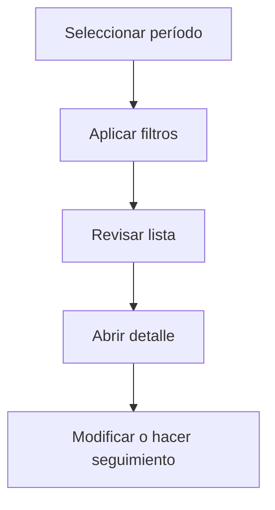

# Gastos

## Para qué sirve esta pantalla

La pantalla de gastos permite consultar y gestionar los gastos periódicos de la empresa en un período seleccionado. Puedes filtrar por tipo, proveedor, centro de coste o estado, y acceder al detalle para informar los importes y hacer el seguimiento del pago.

## Acciones disponibles

- Seleccionar período
- Filtrar por tipo, proveedor o estado
- Crear un gasto nuevo
- Abrir el detalle de un gasto

## Flujo habitual

1. Selecciona el período o ejercicio que quieres consultar.
2. Aplica los filtros que necesites para reducir el volumen de resultados.
3. Revisa la lista y selecciona el elemento que quieras abrir.
4. Accede al detalle para hacer las modificaciones o el seguimiento que corresponda.

## Aspectos importantes

- El comportamiento concreto de cada acción depende del estado del ciclo de vida de la entidad.
- Las acciones de creación, modificación y eliminación pueden estar bloqueadas según el estado.
- Algunos campos son de solo lectura cuando la entidad ya forma parte de un documento comercial vinculado.

## Errores frecuentes

- Si no se muestran gastos, comprueba que el período esté seleccionado.
- Si no se puede marcar como pagada, revisa que la fecha de pago esté informada.

## Proceso básico

