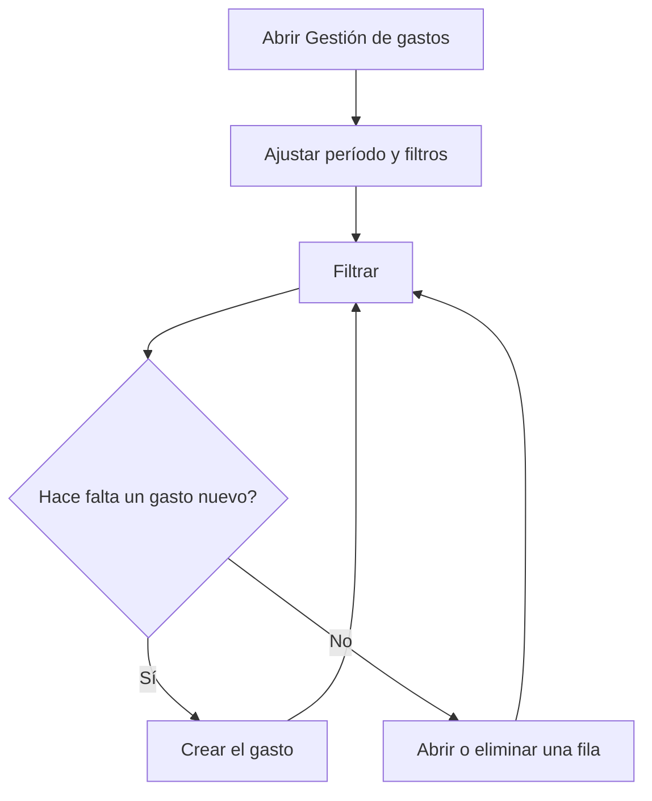

# Gestión de gastos

## Para qué sirve esta pantalla

Lista los gastos generales de la empresa que se registran fuera de las facturas de compra, clasificados por tipo de gasto. De cada gasto ves el tipo, la descripción, la fecha de pago, la frecuencia y el importe, con el total del período al pie de la columna. Estos gastos alimentan el «Panel de gastos» y el panel comparativo de flujo de caja.

## Acciones disponibles

- Filtrar por «Período» (fecha de pago), «Tipo» y «Frecuencia», y aplicarlo con el botón «Filtrar».
- Volver a los filtros iniciales con «Limpiar filtros».
- Crear un gasto con el botón «+» («Crear nuevo»).
- Abrir un gasto haciendo clic en la fila para modificarlo.
- Eliminar un gasto con el icono de papelera («Eliminar») de la fila, tras confirmarlo.
- Ordenar por «Descripción» o «Fecha de pago» haciendo clic en la cabecera de la columna.

## Flujo habitual

1. Abre «Gestión de gastos»: la primera vez muestra los gastos con fecha de pago dentro del año en curso; después, recupera los últimos filtros que usaste.
2. Ajusta el «Período» y, si hace falta, el «Tipo» o la «Frecuencia», y pulsa «Filtrar».
3. Revisa el total de la columna «Importe».
4. Pulsa «+» para registrar un gasto nuevo, o haz clic en una fila para corregirlo.
5. Si sobra un gasto, elimínalo con la papelera y confirma.

## Aspectos importantes

- El «Período» filtra por fecha de pago, no por fecha de alta.
- Cada pago de un gasto recurrente es una fila propia, con su fecha de pago.
- Con «Frecuencia» en «No recurrente» se ven solo los gastos puntuales.
- Los filtros se guardan por usuario al salir de la pantalla. «Limpiar filtros» vuelve al año en curso sin tipo ni frecuencia.
- Eliminar es definitivo. Si el gasto es recurrente, se elimina toda la serie: el gasto original y todos los pagos generados, aunque solo hayas elegido uno.

## Errores frecuentes

- Si falta un gasto que acabas de crear, comprueba que su fecha de pago esté dentro del «Período» y pulsa «Filtrar».
- Si al eliminar un pago han desaparecido otras filas, el gasto era recurrente: se ha borrado toda la serie y habrá que volver a crearla.
- Si la lista sale vacía, revisa que el filtro de «Tipo» o «Frecuencia» no sea demasiado restrictivo.

## Proceso básico

```mermaid
flowchart TD
    A[Abrir Gestión de gastos] --> B[Ajustar período y filtros]
    B --> C[Filtrar]
    C --> D{Hace falta un gasto nuevo?}
    D -->|Sí| E[Crear el gasto]
    D -->|No| F[Abrir o eliminar una fila]
    E --> C
    F --> C
```
