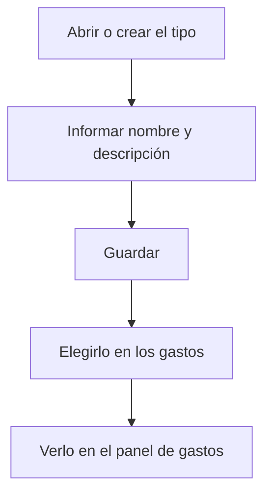

# Tipo de gasto

## Para qué sirve esta pantalla

Es la ficha de un tipo de gasto. Se abre al crear un tipo desde «Gestión de tipos de gasto» («Alta de tipo de gasto») o al abrir uno existente. El nombre que pongas es el que elegirás en el campo «Tipo» de cada gasto y el que verás en el «Panel de gastos».

## Acciones disponibles

- Informar el «Nombre» y la «Descripción».
- Marcar o desmarcar «Desactivada».
- Guardar con «Guardar», en la cabecera de la pantalla.

## Flujo habitual

1. Desde «Gestión de tipos de gasto», pulsa «+» o abre un tipo existente.
2. Escribe un «Nombre» corto y reconocible: es la etiqueta de los gráficos y de los filtros.
3. Escribe una «Descripción» que explique qué gastos incluye.
4. Pulsa «Guardar»: aparece el mensaje de confirmación y vuelves a la lista.

## Aspectos importantes

- «Nombre» y «Descripción» son obligatorios y admiten hasta 250 caracteres cada uno. El nombre debe ser único.
- Cambiar el nombre afecta a todos los gastos del tipo: en el «Panel de gastos» y en el panel de flujo de caja aparecerán con el nombre nuevo.
- «Desactivada» no oculta el tipo: sigue disponible en el campo «Tipo» de los gastos.
- El tipo se elimina desde la lista, y solo se puede si no tiene gastos (consulta la ayuda de «Gestión de tipos de gasto»).

## Errores frecuentes

- Si «Guardar» no hace nada, revisa los mensajes en rojo bajo los campos: falta el nombre o la descripción.
- Si aparece «La entidad ya existe», ya hay otro tipo con el mismo nombre.

## Proceso básico

