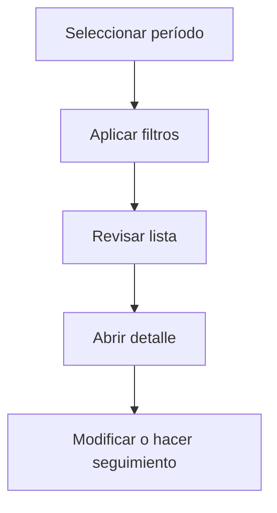

# Tipos de gasto

## Para qué sirve esta pantalla

La pantalla de tipos de gasto permite consultar el catálogo de categorías utilizadas para clasificar los gastos generales de la empresa (sueldos, alquileres, suministros, seguros, etc.). Cada tipo de gasto tiene un código, una descripción y un gestor asociado.

## Acciones disponibles

- Crear un tipo de gasto
- Abrir el detalle de un tipo
- Eliminar un tipo

## Flujo habitual

1. Selecciona el período o ejercicio que quieres consultar.
2. Aplica los filtros que necesites para reducir el volumen de resultados.
3. Revisa la lista y selecciona el elemento que quieras abrir.
4. Accede al detalle para hacer las modificaciones o el seguimiento que corresponda.

## Aspectos importantes

- El comportamiento concreto de cada acción depende del estado del ciclo de vida de la entidad.
- Las acciones de creación, modificación y eliminación pueden estar bloqueadas según el estado.
- Algunos campos son de solo lectura cuando la entidad ya forma parte de un documento comercial vinculado.

## Errores frecuentes

- Si no se puede crear un tipo, comprueba que el código no esté duplicado.
- Si el tipo no aparece en la lista, asegúrate de que esté activo.

## Proceso básico

