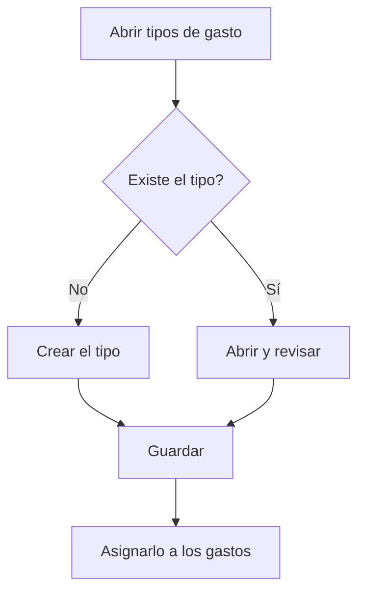

# Gestión de tipos de gasto

## Para qué sirve esta pantalla

Lista los tipos de gasto, el catálogo que clasifica los gastos generales de la empresa que se registran en «Gestión de gastos», fuera de las facturas de compra. Cada gasto de «Gestión de gastos» tiene un tipo, y el «Panel de gastos» agrupa los gastos por tipo en el gráfico por tipología.

## Acciones disponibles

- Crear un tipo con el botón «+» («Crear nuevo»), encima de la lista.
- Abrir un tipo haciendo clic en la fila para modificar su nombre, su descripción o «Desactivada».
- Eliminar un tipo con el icono de papelera («Eliminar») de la fila, tras confirmarlo.

## Flujo habitual

1. Abre «Gestión de tipos de gasto».
2. Comprueba en las columnas «Nombre» y «Descripción» si el tipo que necesitas ya existe.
3. Si no está, pulsa «+», rellena el nombre y la descripción y guarda con «Guardar».
4. Ve a «Gestión de gastos» y usa el tipo nuevo en el campo «Tipo» de los gastos.

## Aspectos importantes

- Eliminar un tipo de gasto borra definitivamente el tipo y también todos los gastos que lo tienen asignado. Esos gastos desaparecen de «Gestión de gastos», del «Panel de gastos» y del panel de flujo de caja.
- El nombre del tipo es el que aparece en el «Panel de gastos» (filtro «Detalle» y gráfico por tipología) cuando el tipo es «Gasto». Si lo cambias, los gastos ya registrados se muestran con el nombre nuevo.
- Marcar un tipo como «Desactivada» solo queda como indicación en la lista: el tipo sigue disponible en el desplegable «Tipo» de los gastos y en los filtros.
- La lista no tiene filtros: muestra siempre todos los tipos.

## Errores frecuentes

- Antes de eliminar un tipo, comprueba en «Gestión de gastos», filtrando por ese «Tipo» y con un período amplio, que no tenga gastos que quieras conservar.
- Si al crearlo aparece «La entidad ya existe», ya hay un tipo con ese nombre.

## Proceso básico

```mermaid
flowchart TD
    A[Abrir tipos de gasto] --> B{Existe el tipo?}
    B -->|No| C[Crear el tipo]
    B -->|Sí| D[Abrir y revisar]
    C --> E[Guardar]
    D --> E
    E --> F[Asignarlo a los gastos]
```
