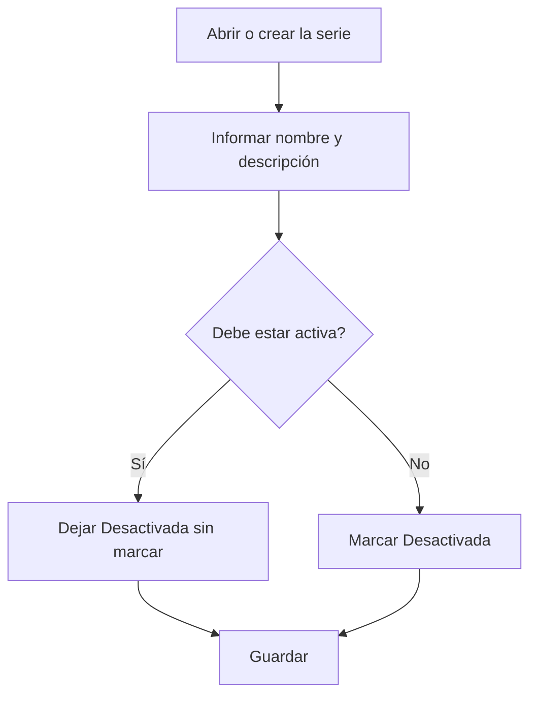

# Serie de facturación

## Para qué sirve esta pantalla

Es la ficha de una serie de facturas de compra. Aquí defines el nombre con el que la elegirás en el campo «Serie» de la factura de compra, una descripción y si está activa. Se abre al crear una serie desde «Series de facturas de compra» («Alta de serie de facturación») o al abrir una existente.

## Acciones disponibles

- Informar el «Nombre de la serie» y la «Descripción».
- Marcar o desmarcar «Desactivada».
- Informar «Prefijo», «Sufijo», «Número siguiente» y «Longitud».
- Guardar con «Guardar», en la cabecera de la pantalla.

## Flujo habitual

1. Desde «Series de facturas de compra», pulsa «+» o abre una serie existente.
2. Escribe el «Nombre de la serie», que es lo que verás en el desplegable de la factura.
3. Escribe una «Descripción» que explique cuándo debe usarse.
4. Deja «Desactivada» sin marcar si la serie debe poder elegirse.
5. Pulsa «Guardar»: aparece el mensaje de confirmación y vuelves a la lista.

## Aspectos importantes

- «Nombre de la serie» y «Descripción» son obligatorios. El nombre admite hasta 50 caracteres y debe ser único; la descripción, hasta 250.
- «Prefijo», «Sufijo», «Número siguiente» y «Longitud» se guardan con la serie, pero actualmente no se utilizan para numerar las facturas de compra. El número interno de la factura lo da el contador «Facturas de compra» del ejercicio (pantalla «Ejercicios»).
- Aun así, el formulario exige que «Número siguiente» sea un entero positivo y que «Longitud» sea un entero entre 1 y 20. «Prefijo» y «Sufijo» admiten hasta 10 caracteres.
- Si marcas «Desactivada», la serie ya no se podrá elegir en las facturas de compra, pero las facturas que ya la tienen asignada no cambian.
- Si la serie se llama «Nacional», las facturas de compra nuevas la propondrán por defecto. Cambiarle el nombre hace que dejen de proponerla.

## Errores frecuentes

- Si «Guardar» no hace nada, revisa los mensajes en rojo bajo los campos: normalmente falta el nombre o la descripción.
- Si aparece «La entidad ya existe», ya hay otra serie con el mismo nombre.
- Si la «Longitud» no se acepta, debe ser un número entero entre 1 y 20.
- Si la serie no aparece en la factura de compra después de guardar, comprueba que «Desactivada» no esté marcada.

## Proceso básico

