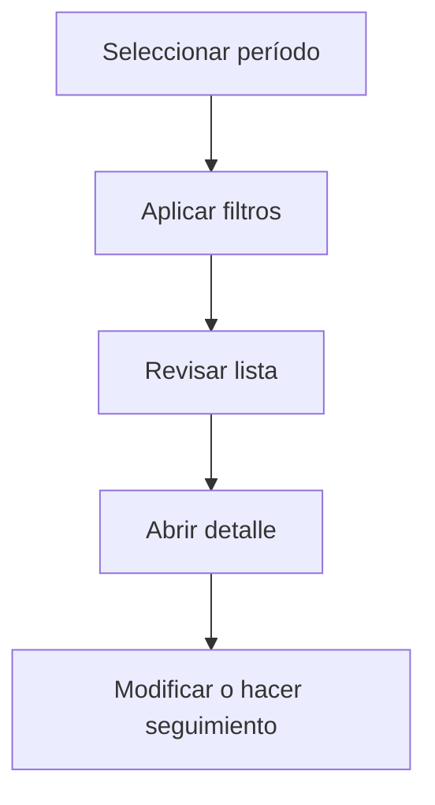

# Series de factura

## Para qué sirve esta pantalla

La pantalla de series de factura permite consultar y gestionar las series documentales utilizadas para numerar las facturas de compra. Cada serie tiene un prefijo, un contador actual y un estado que determina si está activa.

## Acciones disponibles

- Crear una serie de factura
- Abrir el detalle de una serie
- Activar o desactivar una serie

## Flujo habitual

1. Selecciona el período o ejercicio que quieres consultar.
2. Aplica los filtros que necesites para reducir el volumen de resultados.
3. Revisa la lista y selecciona el elemento que quieras abrir.
4. Accede al detalle para hacer las modificaciones o el seguimiento que corresponda.

## Aspectos importantes

- El comportamiento concreto de cada acción depende del estado del ciclo de vida de la entidad.
- Las acciones de creación, modificación y eliminación pueden estar bloqueadas según el estado.
- Algunos campos son de solo lectura cuando la entidad ya forma parte de un documento comercial vinculado.

## Errores frecuentes

- Si no se muestran datos, comprueba que el filtro esté bien informado.
- Si la operación falla, revisa que todos los datos obligatorios estén informados.

## Proceso básico

