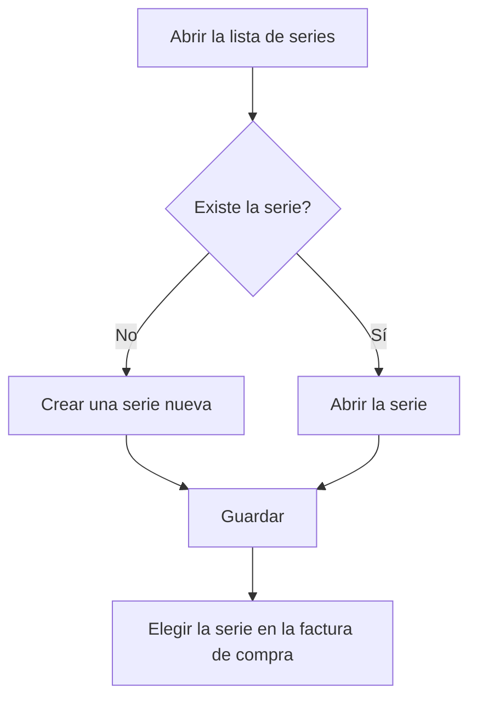

# Series de facturas de compra

## Para qué sirve esta pantalla

Lista las series de facturación que se pueden asignar a las facturas de compra. La serie es el campo «Serie» de la factura de compra y sirve para clasificarla. Desde aquí creas series nuevas, abres las existentes para modificarlas y eliminas las que ya no hacen falta.

## Acciones disponibles

- Crear una serie con el botón «+» («Crear nuevo»), encima de la lista.
- Abrir una serie haciendo clic en la fila para modificarla en «Serie de facturación».
- Eliminar una serie con el icono de papelera («Eliminar») de la fila, tras confirmarlo.
- Ver de un vistazo qué series están desactivadas en la columna «Desactivada».

## Flujo habitual

1. Abre «Series de facturas de compra».
2. Comprueba en las columnas «Nombre de la serie» y «Descripción» si ya existe la serie que necesitas.
3. Si no está, pulsa «+» y rellena la ficha de la serie.
4. Guarda con «Guardar»: vuelves a la lista, que ya muestra la serie nueva.
5. Cuando una serie deje de usarse, ábrela y marca «Desactivada» en lugar de eliminarla.

## Aspectos importantes

- La serie no numera las facturas. El «N.º de factura interna» de la factura de compra sale del contador «Facturas de compra» del ejercicio que corresponde a la fecha de la factura (pantalla «Ejercicios»).
- Las facturas de compra nuevas proponen por defecto la serie llamada «Nacional», si existe y está activa.
- Las series marcadas como «Desactivada» dejan de aparecer en el desplegable «Serie» de la factura de compra.
- Eliminar una serie la borra definitivamente. No se puede eliminar una serie que ya tienen asignada facturas de compra.
- Esta lista no tiene filtros: muestra siempre todas las series, activas y desactivadas.

## Errores frecuentes

- Si la eliminación falla, comprueba si la serie ya se ha usado en alguna factura de compra; en ese caso, desactívala.
- Si una serie no aparece en el desplegable «Serie» de la factura, comprueba que no esté marcada como «Desactivada».
- Si al crearla aparece «La entidad ya existe», ya hay una serie con ese nombre: elige otro.

## Proceso básico

```mermaid
flowchart TD
    A[Abrir la lista de series] --> B{Existe la serie?}
    B -->|No| C[Crear una serie nueva]
    B -->|Sí| D[Abrir la serie]
    C --> E[Guardar]
    D --> E
    E --> F[Elegir la serie en la factura de compra]
```
