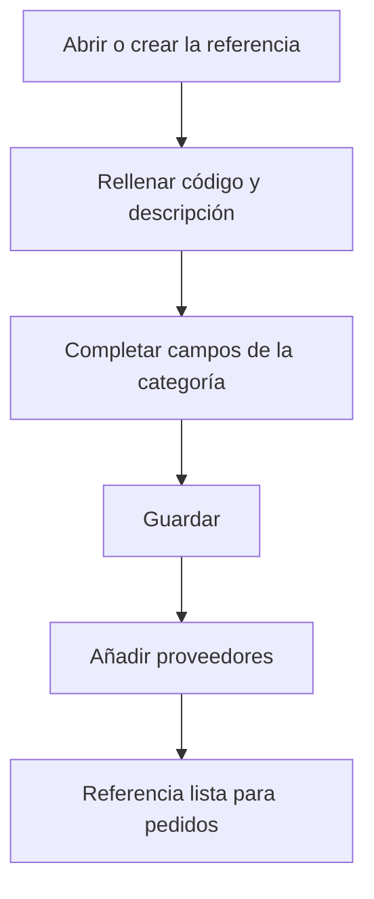

# Referencia de compra

## Para qué sirve esta pantalla

Es la ficha de una referencia de compra: un material, una herramienta o un servicio. Aquí defines los datos que usan los pedidos de compra y los albaranes de recepción y, en la parte inferior, qué proveedores la sirven y en qué condiciones. La búsqueda y la creación se hacen desde la pantalla «Referencias de compra».

## Acciones disponibles

- Rellenar o modificar los datos de la referencia y guardarlos con «Guardar», en la cabecera de la pantalla.
- Añadir un proveedor a la tabla «Proveedores» con el botón «+», indicando «Proveedor», «Código de proveedor», «Descripción del proveedor», «Precio del proveedor» y «Días de suministro».
- Editar las condiciones de un proveedor haciendo clic en su fila.
- Quitar un proveedor con la «X» de la fila, tras confirmarlo.

## Flujo habitual

1. Desde «Referencias de compra», elige la categoría y pulsa «+», o abre una referencia existente.
2. Rellena «Código» y «Descripción».
3. Completa los campos de la categoría: para un material, «Tipo de material», «Formato» e «Impuesto»; para una herramienta, «Impuesto» y «Área de producción»; para un servicio, «Precio del servicio» y «Precio del transporte».
4. Pulsa «Guardar».
5. En la tabla «Proveedores», añade los proveedores que la sirven con su precio y los días de suministro.

## Aspectos importantes

- La «Categoría» viene de la lista desde donde la has creado y no se puede cambiar.
- «Código» (hasta 50 caracteres) y «Descripción» (hasta 250) son obligatorios en todas las categorías.
- Materiales: «Tipo de material», «Formato» e «Impuesto» son obligatorios. Al guardar, el código se completa automáticamente con el nombre del tipo de material entre paréntesis.
- Materiales: «Último coste» se actualiza solo cada vez que se guarda un albarán de recepción con este material. Cuando el material ya tiene albaranes, el campo queda bloqueado.
- Herramientas: «Impuesto» y «Área de producción» son obligatorios, y el formato se asigna automáticamente a unidades.
- Servicios: «Precio del servicio» y «Precio del transporte» son obligatorios; «Impuesto» es opcional.
- Materiales y servicios tienen la casilla «Desactivada».
- Al crear una referencia nueva te quedas en la ficha para poder añadir proveedores; al guardar una referencia existente vuelves a la pantalla anterior.
- Los datos de la tabla «Proveedores» son los mismos que la pestaña «Referencias» de la ficha del proveedor. Al añadir la referencia a un pedido de compra de ese proveedor, se proponen su precio, su descripción y la fecha prevista (hoy más los días de suministro).

## Errores frecuentes

- Si al crear aparece «El material ya existe», la referencia no se ha podido crear: revisa que no la hayas guardado ya y vuelve a abrirla desde la lista.
- Si no se guarda, revisa los mensajes bajo los campos obligatorios de la categoría, por ejemplo «El IVA es obligatorio» o «El formato es obligatorio».
- Si no puedes modificar «Último coste», el material ya tiene albaranes de recepción y el coste se mantiene desde allí.
- Si al añadir un proveedor aparece «La referencia ya existe», ese proveedor ya está: edita su fila.

## Proceso básico

