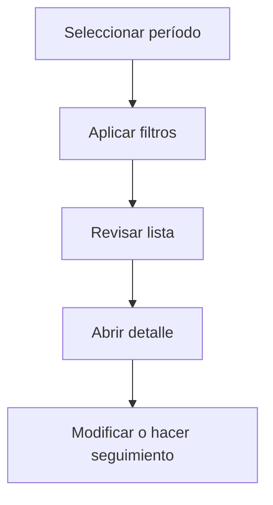

# Materiales

## Para qué sirve esta pantalla

La pantalla de materiales permite consultar el catálogo de materiales utilizados en el proceso productivo. Desde aquí puedes filtrar por tipo, buscar por código o descripción, y acceder al detalle de cada material para gestionar sus datos logísticos.

## Acciones disponibles

- Filtrar por tipo de material
- Buscar por código o descripción
- Crear un material nuevo
- Abrir el detalle de un material existente
- Eliminar un material

## Flujo habitual

1. Selecciona el período o ejercicio que quieres consultar.
2. Aplica los filtros que necesites para reducir el volumen de resultados.
3. Revisa la lista y selecciona el elemento que quieras abrir.
4. Accede al detalle para hacer las modificaciones o el seguimiento que haga falta.

## Aspectos importantes

- El comportamiento concreto de cada acción depende del estado del ciclo de vida de la entidad.
- Las acciones de creación, modificación y eliminación pueden estar bloqueadas según el estado.
- Algunos campos son de solo lectura cuando la entidad ya forma parte de un documento comercial vinculado.

## Errores frecuentes

- Si no se muestran materiales, comprueba que el filtro de tipo no esté vacío o que haya materiales creados.
- Si no se puede eliminar un material, revisa si está utilizado en algún pedido o receta.

## Proceso básico

