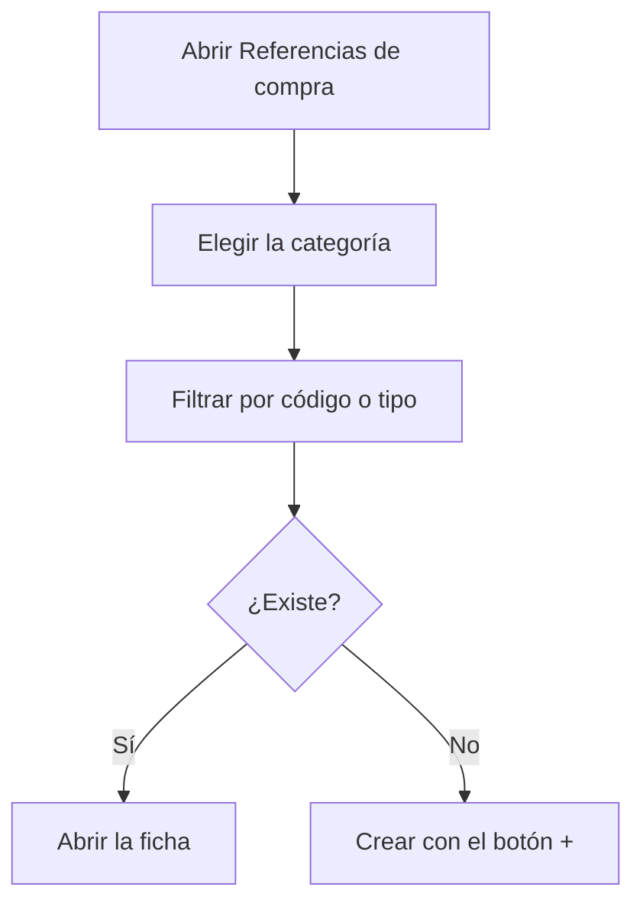

# Referencias de compra

## Para qué sirve esta pantalla

Es el catálogo de las referencias que se compran: materiales, herramientas y servicios. Estas referencias son las que se eligen en las líneas de los pedidos de compra y de los albaranes de recepción. Desde aquí las buscas por categoría, abres la ficha de cada una, creas nuevas o eliminas las que no se han usado.

## Acciones disponibles

- Elegir la «Categoría» (Material, Eina o Servei) para ver sus referencias.
- Buscar por «Código» y, en la categoría Material, filtrar por «Tipo» de material.
- Vaciar el código y el tipo con «Limpiar».
- Crear una referencia de la categoría seleccionada con el botón «+» («Crear nuevo»).
- Abrir la ficha de una referencia haciendo clic en la fila.
- Eliminar una referencia con la «X» de la fila, tras confirmarlo.

## Flujo habitual

1. Abre la pantalla «Referencias de compra».
2. Elige la «Categoría» que quieres consultar.
3. Escribe parte del código en «Código» o, si son materiales, elige un «Tipo».
4. Haz clic en la fila para abrir la ficha y revisarla o modificarla.
5. Si la referencia no existe, pulsa «+» y rellena la ficha nueva.

## Aspectos importantes

- Sin una categoría elegida, la lista aparece vacía.
- Las categorías aparecen con su nombre en catalán: Material, Eina (herramienta) y Servei (servicio).
- El filtro «Tipo» solo se activa para la categoría Material.
- Las columnas cambian según la categoría: los materiales muestran «Tipo», «Formato» y «Densidad (mm)»; los servicios, «Precio» y «Transporte»; las herramientas, el «Área».
- El botón «+» crea una referencia de la categoría que tienes seleccionada. Elígela antes de crear.
- Al volver a la pantalla se recuperan los últimos filtros que habías usado.
- La eliminación es definitiva. Antes de eliminar, la aplicación comprueba si la referencia tiene dependencias, por ejemplo pedidos, albaranes de recepción, stock o lotes, movimientos de almacén, una ruta u órdenes de fabricación, o si forma parte de una lista de materiales o de una tarifa de compra. Si las tiene, no se elimina.

## Errores frecuentes

- Si la lista aparece vacía, comprueba que hayas elegido una «Categoría» y que el filtro «Código» no sea demasiado restrictivo.
- Si no puedes elegir un «Tipo», cambia la categoría a Material.
- Si al eliminar aparece «Referencia con dependencias:», lee los motivos que se detallan: la referencia ya se ha usado y debe conservarse.

## Proceso básico

```mermaid
flowchart TD
    A[Abrir Referencias de compra] --> B[Elegir la categoría]
    B --> C[Filtrar por código o tipo]
    C --> D{¿Existe?}
    D -->|Sí| E[Abrir la ficha]
    D -->|No| F[Crear con el botón +]
```
