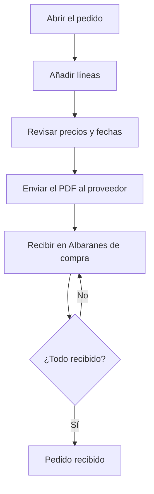

# Pedido de compra

## Para qué sirve esta pantalla

Es la ficha de un pedido de compra a un proveedor: la cabecera con el ejercicio, la fecha, el estado y el proveedor, y las líneas con lo que se pide. Permite seguir cuánto se ha recibido de cada línea y en qué albarán, y sacar el documento del pedido para enviarlo al proveedor. Las líneas pendientes se reciben después en «Albaranes de compra», que es el paso previo a la factura de compra.

## Acciones disponibles

- Modificar «Ejercicio», «Fecha de pedido», «Estado» y «Proveedor» y guardar con «Guardar».
- Descargar el documento del pedido en Word con «Descargar», en el desplegable del botón «Guardar».
- Descargar el pedido en PDF con «Imprimir PDF», en el mismo desplegable.
- Añadir una línea con el botón «+» de «Detalle del pedido».
- Modificar una línea haciendo clic en la fila.
- Eliminar una línea con la «X», tras confirmarlo.
- Desplegar una línea con la flecha de la izquierda para ver sus recepciones: «Albarán», «Cantidad», «Fecha» y «Usuario». El número de albarán abre el albarán de recepción.
- Abrir la ficha de la referencia con el enlace de la columna «Referencia».

## Flujo habitual

1. Abre el pedido desde «Pedidos de compra», o justo después de crearlo.
2. Pulsa «+» en «Detalle del pedido» y elige la «Referencia de compra».
3. Revisa la descripción, la «Fecha prevista» y el «Precio» propuestos, informa la «Cantidad» y pulsa «Crear».
4. Repítelo para cada línea.
5. Descarga el pedido con «Imprimir PDF» o «Descargar» para enviarlo al proveedor.
6. Cuando llegue el material, regístralo en «Albaranes de compra» con «Añadir desde pedido»; la columna «C. recibida» de este pedido se actualizará sola.

## Aspectos importantes

- El «Número» se genera al crear el pedido y no se puede modificar.
- El desplegable «Estado» solo ofrece los estados a los que se puede pasar desde el estado actual, según el ciclo de vida de los pedidos de compra configurado en «Ciclos de vida».
- Al guardar la cabecera con «Guardar», vuelves a la pantalla anterior.
- Al elegir la referencia de una línea, si el proveedor del pedido la tiene en sus referencias, se proponen su precio, su descripción y la fecha prevista (hoy más los días de suministro). Si no la tiene, se proponen el precio y la descripción de la ficha de la referencia.
- El campo «Precio» de la línea es el importe total: se calcula como cantidad por precio unitario. Para los servicios, el precio no se multiplica por la cantidad. El «Precio un.» se recalcula al guardar a partir del importe y la cantidad.
- La «Cantidad» debe ser como mínimo 1, y la referencia y la descripción son obligatorias.
- Cuando una línea ya tiene cantidad recibida, no se puede cambiar su referencia, su cantidad ni su precio, y desaparece la «X» para eliminarla.
- Al recibir material en un albarán, el estado de la línea pasa automáticamente a recibida parcialmente o recibida según la cantidad. Cuando todas las líneas están recibidas, o todas canceladas, el estado del pedido cambia automáticamente.
- Si se quita una recepción de un albarán, la cantidad recibida de la línea se descuenta y el estado se recalcula.
- Las líneas creadas desde «Generación de pedidos de compra» quedan vinculadas a la fase de la orden de fabricación.

## Errores frecuentes

- Si no se guarda la cabecera, revisa que «Ejercicio», «Fecha de pedido», «Estado» y «Proveedor» estén informados.
- Si al crear una línea aparece «La cantidad debe ser superior a 1», informa una cantidad de 1 o más.
- Si una línea no propone precio ni fecha prevista, el proveedor no tiene esa referencia en la pestaña «Referencias» de su ficha: añádela.
- Si no puedes modificar la cantidad o el precio de una línea, ya se ha recibido material de esa línea.
- Si aparece «No se ha podido generar la hoja del pedido», vuelve a intentarlo o usa «Imprimir PDF».

## Proceso básico

