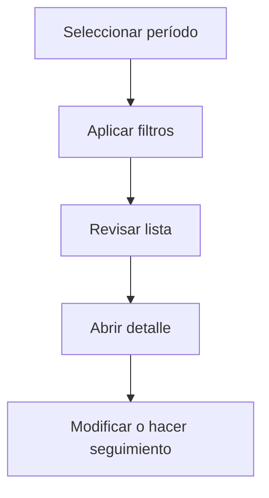

# Pedidos de compra

## Para qué sirve esta pantalla

La pantalla de pedidos de compra permite consultar los pedidos emitidos a proveedores en un período determinado. Puedes filtrar por proveedor, estado, referencia interna o centro de coste, y acceder al detalle de cada pedido para hacer el seguimiento.

## Acciones disponibles

- Seleccionar período de trabajo
- Filtrar por proveedor, estado o referencia
- Limpiar filtros
- Crear un pedido nuevo
- Abrir el detalle de un pedido

## Flujo habitual

1. Selecciona el período o ejercicio que quieres consultar.
2. Aplica los filtros que necesites para reducir el volumen de resultados.
3. Revisa la lista y selecciona el elemento que quieras abrir.
4. Accede al detalle para hacer las modificaciones o el seguimiento que corresponda.

## Aspectos importantes

- El comportamiento concreto de cada acción depende del estado del ciclo de vida de la entidad.
- Las acciones de creación, modificación y eliminación pueden estar bloqueadas según el estado.
- Algunos campos son de solo lectura cuando la entidad ya forma parte de un documento comercial vinculado.

## Errores frecuentes

- Si no se muestran pedidos, comprueba que haya un período seleccionado.
- Si no se puede crear un pedido, revisa que el proveedor tenga dirección de entrega informada.

## Proceso básico

