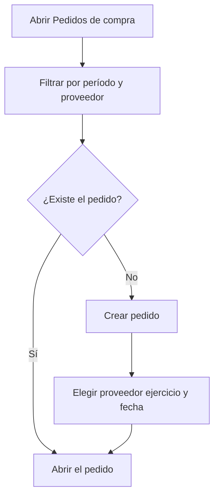

# Pedidos de compra

## Para qué sirve esta pantalla

Lista los pedidos de compra hechos a los proveedores en un período. Es el primer paso del circuito de compras: pedido de compra -> albarán de recepción -> factura de compra. Desde aquí buscas un pedido para hacer su seguimiento, creas uno nuevo o eliminas los que aún no se han tramitado.

## Acciones disponibles

- Filtrar por «Período» y «Proveedor» y aplicar el filtro con «Filtrar».
- Volver al filtro inicial con «Limpiar».
- Crear un pedido con el botón «+» («Crear nuevo»): se abre el diálogo «Crear pedido».
- Abrir un pedido haciendo clic en la fila.
- Eliminar un pedido con la «X» de la fila, tras confirmarlo.

## Flujo habitual

1. Abre la pantalla «Pedidos de compra»: aparecen los pedidos del año en curso.
2. Ajusta el «Período» o elige un «Proveedor» y pulsa «Filtrar».
3. Haz clic en un pedido para ver sus líneas y el estado de recepción.
4. Para hacer un pedido nuevo, pulsa «+», elige «Proveedor», «Ejercicio» y «Fecha» y pulsa «Crear».
5. Se abre directamente el pedido nuevo para añadirle las líneas.

## Aspectos importantes

- Al abrir la pantalla, el período es el año en curso. «Limpiar» quita el proveedor y vuelve a poner el año en curso.
- La lista muestra «Número», «Fecha», «Proveedor» y «Estado».
- El número de pedido se asigna automáticamente con el contador del ejercicio elegido; no se escribe a mano.
- En el diálogo «Crear pedido», el «Ejercicio» se propone con el del año en curso si está activo.
- Todo pedido nuevo nace con el estado inicial del ciclo de vida de los pedidos de compra, configurado en «Ciclos de vida».
- La «X» para eliminar solo aparece mientras el pedido está en el estado inicial. La eliminación es definitiva. Si el pedido se había generado desde una fase de OF, la fase vuelve a quedar disponible en «Generación de pedidos de compra».
- Los pedidos también se pueden crear automáticamente desde «Generación de pedidos de compra», a partir de las fases externas de las órdenes de fabricación.

## Errores frecuentes

- Si aparece «Selecciona un período», el período está incompleto: elige una fecha de inicio y una de fin.
- Si no encuentras un pedido, revisa que su fecha esté dentro del período y que el filtro de proveedor sea el correcto.
- Si no aparece la «X» para eliminar, el pedido ya no está en el estado inicial.
- Si no se puede crear el pedido y aparece «El ejercicio no existe» o «Error al crear el contador», revisa el ejercicio elegido y su contador de pedidos de compra.
- Si aparece que el ciclo de vida no existe o no tiene un estado inicial, hay que revisar el ciclo de vida de los pedidos de compra en «Ciclos de vida».

## Proceso básico

```mermaid
flowchart TD
    A[Abrir Pedidos de compra] --> B[Filtrar por período y proveedor]
    B --> C{¿Existe el pedido?}
    C -->|Sí| D[Abrir el pedido]
    C -->|No| E[Crear pedido]
    E --> F[Elegir proveedor ejercicio y fecha]
    F --> D
```
