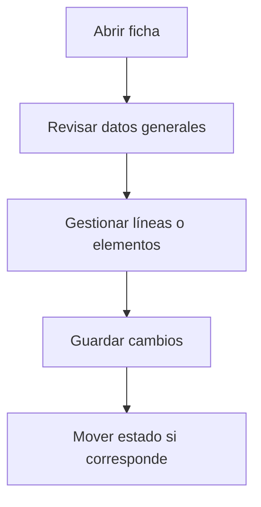

# Fase a pedido de compra

## Para qué sirve esta pantalla

La pantalla de fase a pedido de compra permite iniciar un pedido de compra desde una fase de una orden de producción. Seleccionando la fase e informando los datos iniciales, el sistema genera automáticamente el pedido de compra con el proveedor asociado al material o servicio.

## Acciones disponibles

- Seleccionar la fase de orden de producción
- Informar el proveedor
- Seleccionar materiales o servicios a comprar
- Generar el pedido de compra

## Flujo habitual

1. Revisa los datos generales de la ficha.
2. Gestiona las líneas o los elementos asociados según corresponda.
3. Guarda los cambios cuando hayáis terminado.
4. Si la ficha tiene un ciclo de vida, mueve el estado según corresponda.

## Aspectos importantes

- El comportamiento concreto de cada acción depende del estado del ciclo de vida de la entidad.
- Las acciones de creación, modificación y eliminación pueden estar bloqueadas según el estado.
- Algunos campos son de solo lectura cuando la entidad ya forma parte de un documento comercial vinculado.

## Errores frecuentes

- Si no se muestran fases, comprueba que haya órdenes de producción con fases pendientes de comprar.
- Si el pedido no se genera, revisa que la fase tenga un proveedor asociado.

## Proceso básico

