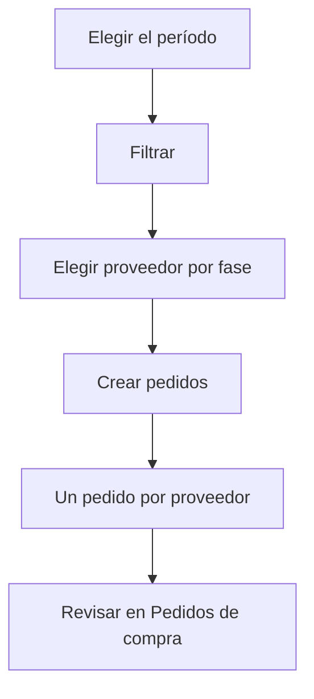

# Generación de pedidos de compra

## Para qué sirve esta pantalla

Genera pedidos de compra a partir de las fases externas de las órdenes de fabricación, es decir, las fases que hace un proveedor (por ejemplo, un tratamiento o un servicio subcontratado). Eliges el proveedor de cada fase y la aplicación crea los pedidos agrupados por proveedor. El circuito continúa como cualquier compra: pedido de compra -> albarán de recepción -> factura de compra.

## Acciones disponibles

- Elegir el «Período» y cargar las fases con «Filtrar».
- Devolver el período al año en curso con «Limpiar».
- Elegir el proveedor de cada fase en el desplegable de la columna «Proveedor».
- Quitar el proveedor de una fase con la cruz del desplegable, para que no se pida.
- Crear los pedidos de todas las fases con proveedor con «Crear pedidos».

## Flujo habitual

1. Abre la pantalla «Generación de pedidos de compra».
2. Revisa el «Período» y pulsa «Filtrar» para cargar las fases pendientes.
3. Para cada fase que quieras encargar, elige el proveedor en la columna «Proveedor».
4. Pulsa «Crear pedidos».
5. Al terminar, la aplicación te lleva a «Pedidos de compra», donde encontrarás los pedidos nuevos para revisarlos y enviarlos.

## Aspectos importantes

- La lista no se carga sola: hay que pulsar «Filtrar». Al abrir la pantalla se recupera el último período que habías usado o, si no lo hay, el año en curso.
- Aparecen las fases marcadas como trabajo externo que tienen una referencia de servicio y que todavía no tienen pedido de compra. La orden de fabricación debe tener la fecha planificada dentro del período y estar en un estado marcado para servicios externos en el ciclo de vida de las órdenes de fabricación («Ciclos de vida»).
- El desplegable «Proveedor» muestra los proveedores que tienen la referencia de servicio de la fase en la pestaña «Referencias» de su ficha. Si ningún proveedor la tiene, el desplegable aparece vacío.
- Se crea un pedido por proveedor con todas sus fases, con fecha de hoy y en el ejercicio que incluye la fecha de hoy. El número se asigna automáticamente.
- Cada fase genera una línea con la referencia de servicio y la «Cantidad planificada» de la OF. El precio unitario es el «Precio del proveedor» de la referencia o, si el proveedor no la tiene, el último coste de la referencia. La fecha prevista es hoy más los días de suministro del proveedor.
- Una vez creado el pedido, la fase queda vinculada a él y ya no vuelve a aparecer en esta pantalla. Si se elimina el pedido, la fase vuelve a estar disponible.

## Errores frecuentes

- Si aparece «OF no seleccionadas», no has elegido ningún proveedor: elige como mínimo uno para una fase.
- Si la lista aparece vacía, revisa el período, que la OF esté en un estado de servicio externo y que la fase no tenga ya un pedido.
- Si el desplegable «Proveedor» no tiene opciones, añade la referencia de servicio en la pestaña «Referencias» del proveedor que la hace.
- Si aparece «Error al crear el pedido», revisa que haya un ejercicio que incluya la fecha de hoy y que los ciclos de vida de los pedidos de compra y de sus líneas tengan estado inicial.
- Si la referencia aparece como «Desconocida», no se encuentra la referencia de servicio de la fase: revisa la fase en la orden de fabricación.

## Proceso básico

```mermaid
flowchart TD
    A[Elegir el período] --> B[Filtrar]
    B --> C[Elegir proveedor por fase]
    C --> D[Crear pedidos]
    D --> E[Un pedido por proveedor]
    E --> F[Revisar en Pedidos de compra]
```
