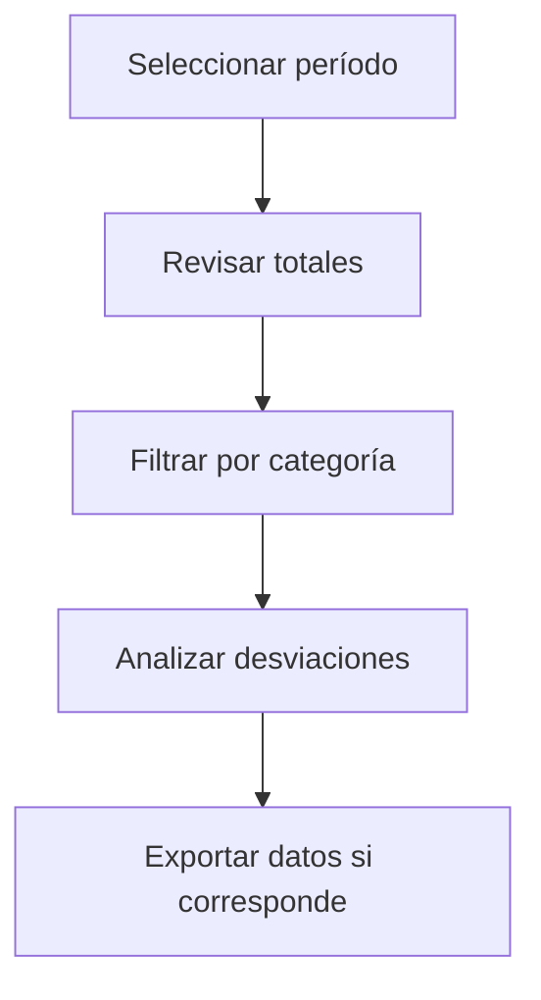

# Facturas de compra por período

## Para qué sirve esta pantalla

La pantalla de facturas por período permite consultar de forma agregada las facturas de compra de un período seleccionado. Es especialmente útil para hacer el cierre contable: puedes ver el total de IVA deductible, los importes pendientes de pago y los vencimientos próximos.

## Acciones disponibles

- Seleccionar el período contable
- Aplicar filtros
- Revisar totales de IVA e importes
- Exportar a hoja de cálculo

## Flujo habitual

1. Selecciona el período contable que quieres consultar.
2. Revisa los totales agregados por categoría.
3. Filtra por tipo de gasto o proveedor si corresponde.
4. Exporta los datos si necesitas hacer un análisis más detallado.

## Aspectos importantes

- El comportamiento concreto de cada acción depende del estado del ciclo de vida de la entidad.
- Las acciones de creación, modificación y eliminación pueden estar bloqueadas según el estado.
- Algunos campos son de solo lectura cuando la entidad ya forma parte de un documento comercial vinculado.

## Errores frecuentes

- Si no se muestran datos, comprueba que el filtro esté bien informado.
- Si la operación falla, revisa que todos los datos obligatorios estén informados.

## Proceso básico

