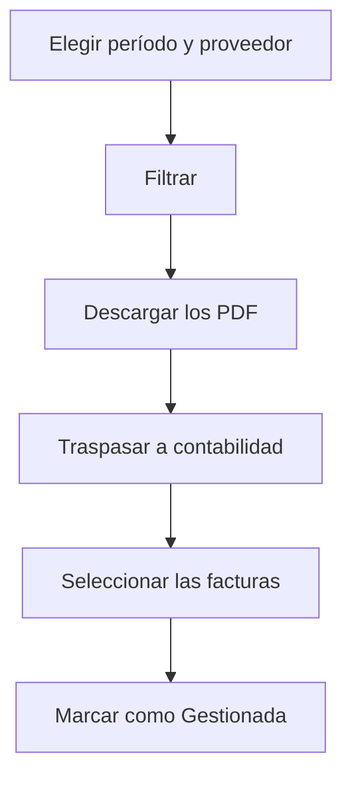

# Contabilización de facturas de compra

## Para qué sirve esta pantalla

Sirve para pasar a contabilidad las facturas de compra de un período. Lista las facturas que aún no están gestionadas, permite descargar sus documentos adjuntos y marcarlas como «Gestionada» de golpe cuando ya se han traspasado. Es el paso posterior al registro de la factura en «Facturas de compra».

## Acciones disponibles

- Filtrar por «Período» y «Proveedor» y aplicar el filtro con «Filtrar».
- Incluir en la lista las facturas ya gestionadas marcando «Gestionadas».
- Limpiar los filtros y vaciar la lista con «Limpiar filtros».
- Seleccionar facturas con la casilla de cada fila o todas con la casilla de la cabecera.
- Marcar las facturas seleccionadas como «Gestionada» con el botón verde de validación, a la derecha de los filtros.
- Descargar los documentos adjuntos de una factura con el icono de descarga de la fila.

## Flujo habitual

1. Abre «Contabilización de facturas de compra». La lista aparece vacía.
2. Elige el «Período» (por ejemplo, el mes o el trimestre que quieres contabilizar) y, si hace falta, un proveedor, y pulsa «Filtrar».
3. Descarga el PDF de cada factura con el icono de descarga y pásala al programa de contabilidad.
4. Selecciona las facturas que ya has traspasado.
5. Pulsa el botón verde de validación: aparece «Facturas contabilizadas» con el número de facturas, y desaparecen de la lista.

## Aspectos importantes

- La lista no se carga hasta que eliges un «Período» y filtras. El período filtra por la fecha de factura.
- Sin marcar «Gestionadas», la lista oculta las facturas que ya están en el estado «Gestionada». Al marcar o desmarcar la casilla, la lista se vuelve a cargar si hay período.
- El botón de validación pone el estado «Gestionada» a todas las facturas seleccionadas, sea cual sea su estado actual. El estado «Gestionada» debe existir en el ciclo de vida de las facturas de compra.
- Esta pantalla no deshace la marca: para cambiar el estado de una factura, ábrela en «Facturas de compra».
- El icono de descarga baja todos los archivos adjuntos en la pestaña «Archivos» de la factura. Si no hay ninguno, no se descarga nada.
- La columna «Vencimiento» muestra el último vencimiento, o la fecha de factura si no tiene. La columna «Importe base» es la base imponible.
- Las filas no abren la ficha de la factura.

## Errores frecuentes

- Si aparece «Filtro inválido» con «Selecciona un período», elige una fecha de inicio y una de fin.
- Si el botón de validación está desactivado, selecciona al menos una factura.
- Si una factura no aparece, comprueba que la fecha de factura esté dentro del período y, si ya está gestionada, marca «Gestionadas».
- Si al pulsar el botón de validación no pasa nada, comprueba en «Ciclos de vida» que las facturas de compra tengan un estado llamado «Gestionada».
- Si la descarga no baja ningún archivo, adjunta el PDF en la pestaña «Archivos» de la factura.

## Proceso básico

```mermaid
flowchart TD
    A[Elegir período y proveedor] --> B[Filtrar]
    B --> C[Descargar los PDF]
    C --> D[Traspasar a contabilidad]
    D --> E[Seleccionar las facturas]
    E --> F[Marcar como Gestionada]
```
