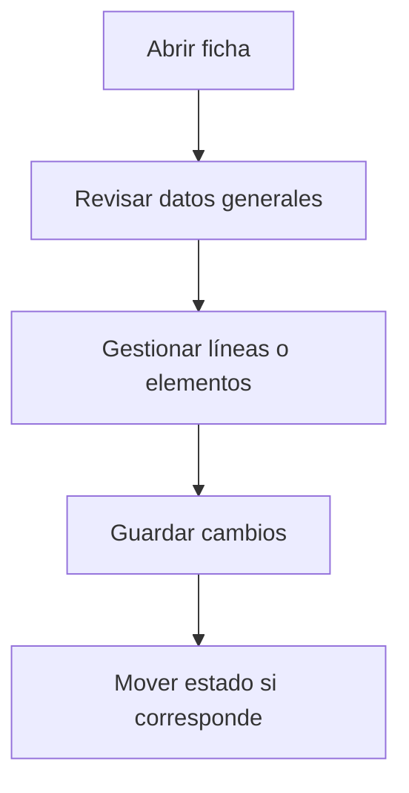

# Factura de compra

## Para qué sirve esta pantalla

Pantalla de gestión de la entidad.

## Acciones disponibles

- Guardar la factura
- Añadir, editar y eliminar líneas
- Gestionar fechas de vencimiento
- Modificar el estado de la factura
- Contabilizar la factura
- Importar líneas desde albarán

## Flujo habitual

1. Revisa los datos generales de la ficha.
2. Gestiona las líneas o los elementos asociados según corresponda.
3. Guarda los cambios cuando hayáis terminado.
4. Si la ficha tiene un ciclo de vida, mueve el estado según corresponda.

## Aspectos importantes

- El comportamiento concreto de cada acción depende del estado del ciclo de vida de la entidad.
- Las acciones de creación, modificación y eliminación pueden estar bloqueadas según el estado.
- Algunos campos son de solo lectura cuando la entidad ya forma parte de un documento comercial vinculado.

## Errores frecuentes

- Si los vencimientos no se calculan, comprueba que el proveedor tenga condiciones de pago definidas.
- Si la factura no se puede contabilizar, revisa que todas las líneas tengan cuenta contable asignada.

## Proceso básico

