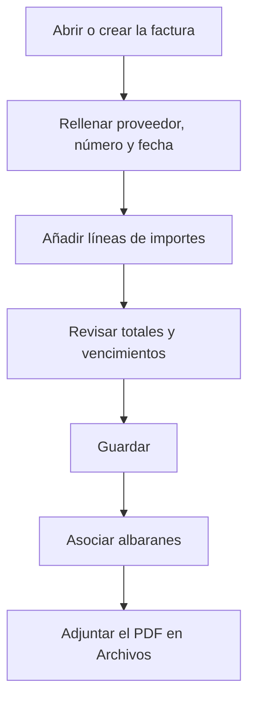

# Factura de compra

## Para qué sirve esta pantalla

Es la ficha de una factura de proveedor: la cabecera, el desglose de importes por tipo de IVA, los vencimientos de pago, los albaranes que cubre y los documentos adjuntos. Desde aquí se da de alta una factura a mano o se revisa y modifica una existente. Es el último paso del circuito `pedido de compra -> albarán de recepción -> factura de compra`.

## Acciones disponibles

- Rellenar la cabecera: «Ejercicio», «Serie», «Estado», «Proveedor», «N.º de factura del proveedor», «Fecha de factura», «Forma de pago», «Portes», «% IRPF» y «% descuento».
- Guardar la factura con «Guardar» en la cabecera de la pantalla.
- Añadir líneas de importes en la pestaña «Importes» con el botón «+», modificarlas haciendo clic en la fila y eliminarlas con la cruz.
- Consultar los vencimientos en la pestaña «Vencimientos».
- Repartir a mano los importes de los vencimientos con «Editar vencimientos», en el menú de la flecha del botón «Guardar».
- Asociar albaranes pendientes de facturar del proveedor en la pestaña «Albaranes» con el botón «+», y desasociarlos con la cruz.
- Adjuntar o descargar documentos en la pestaña «Archivos».

## Flujo habitual

1. Desde «Facturas de compra», pulsa «+» para crear una factura, o abre una desde la lista.
2. Elige el «Proveedor»: la «Forma de pago» se rellena con la del proveedor.
3. Escribe el «N.º de factura del proveedor» y la «Fecha de factura».
4. En «Importes», añade una línea por cada tipo de IVA con el «Importe base» y el «IVA».
5. Completa «Portes», «% IRPF» o «% descuento» si la factura los lleva, y comprueba el «Total».
6. Pulsa «Guardar».
7. Vuelve a abrir la factura para asociarle los albaranes en «Albaranes» y adjuntar el PDF en «Archivos».

## Aspectos importantes

- Una factura nueva se propone con el ejercicio de la fecha de factura, la serie «Nacional» y el estado «Nova». El número interno se asigna al guardar, con el contador del ejercicio que corresponde a la fecha de factura, y la factura queda en ese ejercicio.
- El «Estado» solo ofrece las transiciones permitidas desde el estado actual, definidas en «Ciclos de vida».
- Los totales se calculan solos: «Base» es la suma de las bases de las líneas de importes; el «Total» es base más portes, más impuestos, menos la retención de IRPF (calculada sobre base y portes), menos el descuento.
- Cada línea de importes calcula la cuota a partir del «Importe base» y el porcentaje del impuesto; con un impuesto de inversión del sujeto pasivo la cuota es 0.
- Los vencimientos se generan a partir de la forma de pago, la fecha de factura y el total. Se recalculan cada vez que cambias la fecha, la forma de pago, los portes, el IRPF, el descuento o las líneas de importes, y sustituyen a los anteriores, también a los repartidos a mano.
- «Editar vencimientos» solo aparece cuando la factura tiene más de un vencimiento. La suma de los importes debe coincidir con el total de la factura; los cambios se guardan al pulsar «Guardar» al pie de la tabla.
- En una factura ya guardada, las líneas de importes se guardan en el momento de añadirlas, modificarlas o eliminarlas. Los totales de la cabecera se guardan con «Guardar».
- No puede haber dos facturas del mismo proveedor con el mismo «N.º de factura del proveedor». La comprobación no se aplica si el número es «--», que es el valor por defecto de una factura nueva.
- En «Albaranes» solo se ofrecen los albaranes del proveedor que aún no están facturados. Desasociar uno lo deja de nuevo pendiente de facturar.
- Después de «Guardar», la aplicación vuelve a la pantalla anterior.

## Errores frecuentes

- Si aparece «Debe introducir los importes de la factura», añade al menos una línea en «Importes».
- Si aparece «Todas las líneas de IVA deben tener un impuesto», abre las líneas sin impuesto y elige uno.
- Si no se generan vencimientos, comprueba que haya proveedor, forma de pago e impuesto en todas las líneas de importes.
- Si aparece «La factura del proveedor … ya está registrada como factura …», revisa el número: esa factura ya existe.
- Si aparece «Ejercicio inválido», comprueba que haya un ejercicio activo que incluya la fecha de factura.
- Si aparece «La suma (…) no coincide con el total de la factura (…)», ajusta los vencimientos hasta que la «Diferencia» sea 0.
- Si no puedes asociar albaranes a una factura nueva, guárdala primero y vuelve a abrirla.

## Proceso básico

```mermaid
flowchart TD
    A[Abrir o crear la factura] --> B[Rellenar proveedor, número y fecha]
    B --> C[Añadir líneas de importes]
    C --> D[Revisar totales y vencimientos]
    D --> E[Guardar]
    E --> F[Asociar albaranes]
    F --> G[Adjuntar el PDF en Archivos]
```
