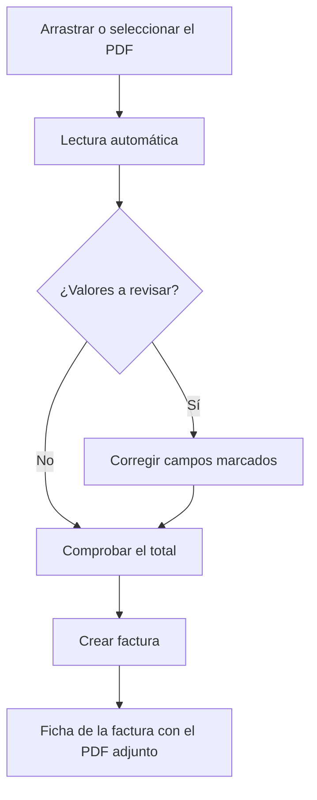

# Importar factura de compra

## Para qué sirve esta pantalla

Crea una factura de compra a partir del PDF que te ha enviado el proveedor. El sistema lee el PDF, rellena un borrador de factura y marca los valores que hay que revisar. La factura no se crea hasta que la aceptas.

## Acciones disponibles

- Arrastrar el PDF a la pantalla o seleccionarlo con el botón
- Ver el PDF junto al borrador, con zoom y pantalla completa
- Revisar y corregir los datos de cabecera de la factura
- Añadir, editar y eliminar líneas del desglose de IVA
- Cambiar de PDF y volver a leerlo
- Crear la factura desde el botón de la cabecera

## Flujo habitual

1. Arrastra el PDF de la factura o pulsa "Selecciona un PDF".
2. Espera a que el sistema lea la factura. Puede tardar hasta un minuto.
3. Revisa la lista de valores a revisar y los campos marcados en amarillo, comparándolos con el PDF.
4. Comprueba que el total calculado cuadre con el total del PDF.
5. Pulsa "Crear factura". La factura se crea con el PDF adjunto y se abre su ficha.

## Aspectos importantes

- Solo se leen PDF digitales de hasta 20 MB. Los documentos escaneados pueden no leerse bien.
- El proveedor se asigna automáticamente si hay un único proveedor activo con el NIF de la factura.
- Cada tipo de IVA se relaciona con el impuesto del mismo porcentaje. Si no hay ninguno, la línea queda sin impuesto y debes elegirlo.
- La retención de IRPF se rellena en el campo "% IRPF".
- El recargo de equivalencia no se importa: queda marcado para que lo introduzcas manualmente.
- Los portes y los descuentos no se rellenan, porque en la factura ya forman parte de la base imponible.
- Un campo marcado deja de mostrar el aviso cuando lo modificas.
- La nueva factura se crea en el ejercicio actual, la serie "Nacional" y el estado inicial.

## Errores frecuentes

- "El fichero debe ser un PDF": el documento no es un PDF. Expórtalo a PDF y vuelve a intentarlo.
- "No se han podido leer los datos de la factura": el PDF puede estar escaneado o protegido. Introduce la factura manualmente.
- "La lectura automática de facturas no está configurada": el administrador debe configurar el servicio de lectura.
- El total calculado no cuadra: revisa las bases, las cuotas y la retención, y si hay recargo de equivalencia.
- "La factura se ha creado, pero no se ha podido adjuntar el PDF": adjúntalo desde la pestaña Archivos de la factura.

## Proceso básico

