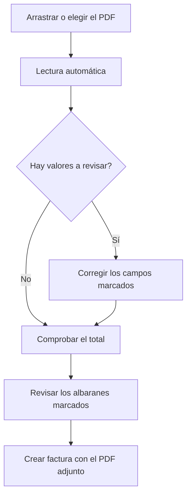

# Importar factura de compra

## Para qué sirve esta pantalla

Crea una factura de compra a partir del PDF que ha enviado el proveedor. El sistema lee el PDF, prepara un borrador de la factura, marca los valores que hay que revisar y propone los albaranes pendientes que cubre. No se guarda nada hasta que pulsas «Crear factura». Se llega desde el botón de PDF de «Facturas de compra».

## Acciones disponibles

- Arrastrar el PDF a la pantalla o elegirlo con «Selecciona un PDF».
- Consultar el PDF junto al borrador, con zoom y pantalla completa.
- Cambiar de documento con «Cambiar PDF», o volver a leerlo con «Volver a intentarlo» si la lectura falla.
- Revisar y corregir la cabecera de la factura (los mismos campos que en la ficha de la factura).
- Añadir, modificar y eliminar líneas del «Desglose de IVA».
- Crear el proveedor sin salir de la pantalla con «Crear proveedor», cuando el NIF de la factura no corresponde a ningún proveedor.
- Abrir la factura ya registrada con «Abrir factura», cuando el PDF es un duplicado.
- Marcar o desmarcar los «Albaranes pendientes de facturar» que cubre la factura.
- Crear la factura con «Crear factura», en la cabecera de la pantalla.

## Flujo habitual

1. En «Facturas de compra», pulsa el botón de PDF («Importar factura (PDF)»).
2. Arrastra el PDF o pulsa «Selecciona un PDF», y espera mientras aparece «Leyendo la factura...». Puede tardar hasta un minuto.
3. Revisa la lista de valores a revisar y los campos marcados, comparándolos con el PDF.
4. Comprueba que el «Total calculado» cuadre con el «Total del PDF».
5. Revisa los albaranes marcados en «Albaranes pendientes de facturar» y comprueba que «Albaranes seleccionados» cuadre con la «Base de la factura».
6. Pulsa «Crear factura». La factura se crea con los albaranes marcados, se le adjunta el PDF y se abre su ficha.

## Aspectos importantes

- Se aceptan PDF digitales de hasta 20 MB. El sistema lee el NIF y el nombre del proveedor, el número y la fecha de factura, las bases y las cuotas por tipo de IVA, la retención de IRPF, el total y los números de albarán que aparecen en la factura.
- El proveedor se asigna solo si hay exactamente un proveedor activo con el NIF de la factura, y entonces la «Forma de pago» se rellena con la del proveedor. Si hay varios, hay que elegirlo. Si no hay ninguno, «Crear proveedor» abre el alta con el nombre y el NIF ya rellenados y, al guardarlo, queda asignado a la factura.
- Cada tipo de IVA se relaciona con el impuesto activo del mismo porcentaje. Si no hay ninguno o hay varios, la línea queda sin impuesto, con el tipo leído del PDF, y tienes que elegirlo.
- La retención se rellena en el campo «% IRPF». Si el PDF solo lleva el importe retenido, el porcentaje se calcula sobre la base.
- El recargo de equivalencia no se importa: queda marcado para que lo introduzcas a mano, y el «Total calculado» indica el importe de recargo no importado.
- Los «Portes» y el «% descuento» no se rellenan.
- Se marcan para revisar los valores que no se han podido leer, los leídos con poca fiabilidad, un NIF español no válido, una cuota que no cuadra con la base y el tipo, y un total que no cuadra. Un campo deja de mostrar el aviso cuando lo modificas, y una línea de IVA cuando la guardas.
- Los albaranes pendientes se listan con su importe sin IVA. Se marcan solos los albaranes cuyo número (del proveedor o interno) aparece en la factura; si no hay ninguno, la combinación única de albaranes que suma la base imponible. Si cambias el proveedor, la lista se recarga.
- La factura se crea en el ejercicio de la fecha de factura, con la serie «Nacional» y el estado «Nova», y el número interno se asigna al crearla.
- «Cambiar PDF» vuelve a leer el documento nuevo y descarta las correcciones hechas en el borrador.
- Si el servicio de lectura no está configurado, la pantalla lo avisa y el botón de importar no aparece en «Facturas de compra».

## Errores frecuentes

- Si aparece «El fichero debe ser un PDF» o «El PDF supera los 20 MB», exporta la factura a PDF o reduce su tamaño y vuelve a intentarlo.
- Si aparece «No se han podido leer los datos de la factura», el PDF puede estar escaneado o protegido: introduce la factura a mano desde «Facturas de compra».
- Si aparece «El servicio de lectura de facturas no está disponible», espera un rato y pulsa «Volver a intentarlo».
- Si el total calculado no cuadra, revisa las bases, las cuotas, el «% IRPF» y si la factura lleva recargo o portes.
- Si aparece «Factura duplicada», la factura ya está registrada: ábrela con «Abrir factura», que se abre en una pestaña nueva.
- Si aparece «Todas las líneas de IVA deben tener un impuesto», elige el impuesto de las líneas marcadas.
- Si aparece «Algún albarán seleccionado no es del proveedor o ya está facturado», no se ha creado nada: desmarca ese albarán y vuelve a crear la factura.
- Si aparece «La factura se ha creado, pero no se ha podido adjuntar el PDF», adjúntalo desde la pestaña «Archivos» de la factura.

## Proceso básico

