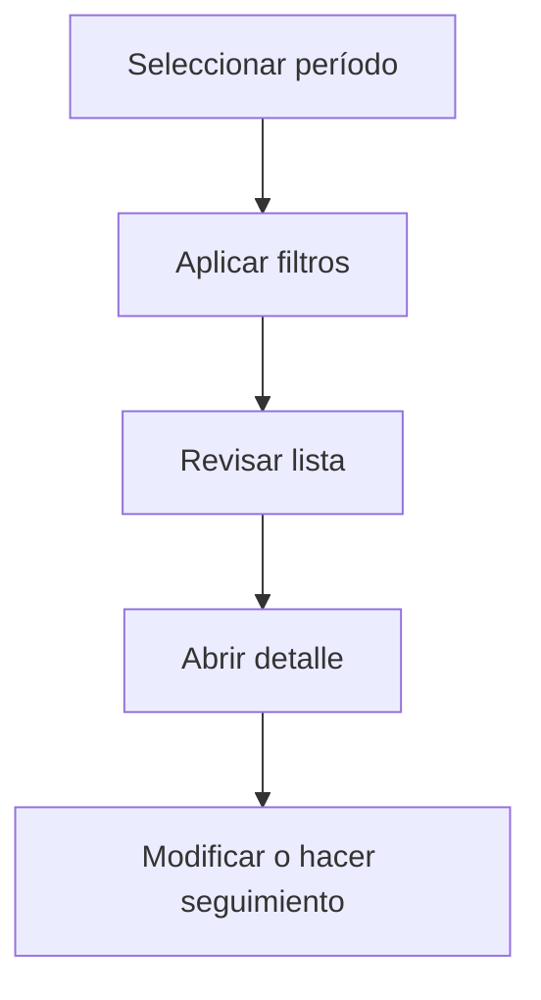

# Facturas de compra

## Para qué sirve esta pantalla

La pantalla de facturas de compra permite consultar las facturas recibidas de proveedores. Puedes filtrar por proveedor, estado, serie, fechas o período contable, y acceder al detalle para revisar el contenido, las fechas de vencimiento y su estado.

## Acciones disponibles

- Filtrar por proveedor, estado, serie o período
- Crear una factura manual
- Abrir el detalle de una factura
- Importar facturas

## Flujo habitual

1. Selecciona el período o ejercicio que quieres consultar.
2. Aplica los filtros que necesites para reducir el volumen de resultados.
3. Revisa la lista y selecciona el elemento que quieras abrir.
4. Accede al detalle para hacer las modificaciones o el seguimiento que corresponda.

## Aspectos importantes

- El comportamiento concreto de cada acción depende del estado del ciclo de vida de la entidad.
- Las acciones de creación, modificación y eliminación pueden estar bloqueadas según el estado.
- Algunos campos son de solo lectura cuando la entidad ya forma parte de un documento comercial vinculado.

## Errores frecuentes

- Si no se muestran facturas, comprueba que el filtro de período esté correctamente informado.
- Si la importación falla, revisa que el formato del archivo sea el esperado.

## Proceso básico

