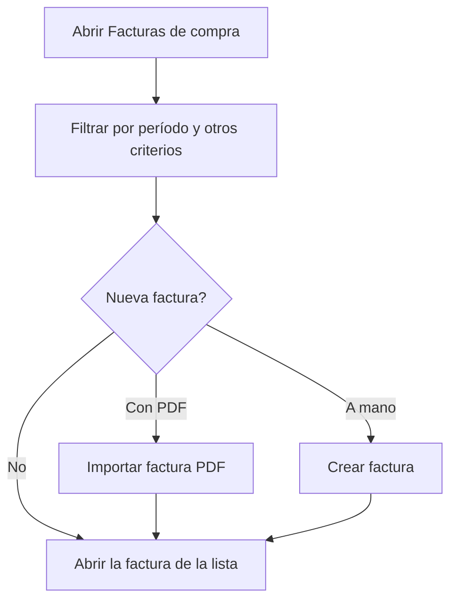

# Facturas de compra

## Para qué sirve esta pantalla

Lista las facturas recibidas de los proveedores. Sirve para encontrarlas por fecha, proveedor, forma de pago, cuenta bancaria o vencimiento, crear una nueva a mano o a partir del PDF del proveedor, y abrir su ficha. La factura cierra el circuito de compra: `pedido de compra -> albarán de recepción -> factura de compra -> vencimientos`.

## Acciones disponibles

- Filtrar por «Período», «Proveedor», «Método de pago», «Número de cuenta» y «Vencimiento», y aplicar el filtro con «Filtrar».
- Limpiar los filtros con «Limpiar filtros»: el período vuelve al año en curso.
- Crear una factura a mano con el botón «+» («Crear nuevo»).
- Importar una factura desde el PDF del proveedor con el botón de PDF («Importar factura (PDF)»).
- Abrir una factura haciendo clic en la fila.
- Eliminar una factura con la cruz de la fila, solo mientras está en el estado inicial.

## Flujo habitual

1. Abre «Facturas de compra». Se muestran las facturas del año en curso o los últimos filtros que aplicaste.
2. Ajusta el «Período» y, si hace falta, el proveedor o el vencimiento, y pulsa «Filtrar».
3. Revisa el total de la columna «Importe» al pie de la tabla.
4. Para registrar una factura en PDF, pulsa el botón de PDF; si la tienes que introducir a mano, pulsa «+».
5. Haz clic en una fila para revisarla o modificarla.

## Aspectos importantes

- El «Período» filtra por la fecha de factura y es obligatorio.
- La columna «Vencimiento» muestra el último vencimiento de la factura, o la fecha de factura si no tiene. El filtro «Vencimiento» usa esta misma fecha.
- El filtro «Número de cuenta» busca por el número de cuenta bancaria del proveedor.
- La columna «Importe» es el total de la factura, y el pie de la tabla muestra su suma.
- La pantalla recuerda los últimos filtros que has aplicado.
- El botón de importar desde PDF solo aparece cuando el servicio de lectura de facturas está configurado.
- La cruz de eliminar solo aparece en las facturas que están en el estado inicial del ciclo de vida de las facturas de compra. La eliminación es definitiva.

## Errores frecuentes

- Si aparece «Filtro inválido» con «Selecciona un período», elige una fecha de inicio y una de fin en el «Período».
- Si no encuentras una factura que sabes que existe, revisa que su fecha de factura esté dentro del período y que no tengas filtros guardados de proveedor, forma de pago o vencimiento.
- Si no ves el botón de importar PDF, el servicio de lectura no está configurado; debe revisarlo el administrador.
- Si no puedes eliminar una factura, comprueba que siga en el estado inicial.

## Proceso básico

```mermaid
flowchart TD
    A[Abrir Facturas de compra] --> B[Filtrar por período y otros criterios]
    B --> C{Nueva factura?}
    C -->|Con PDF| D[Importar factura PDF]
    C -->|A mano| E[Crear factura]
    C -->|No| F[Abrir la factura de la lista]
    D --> F
    E --> F
```
