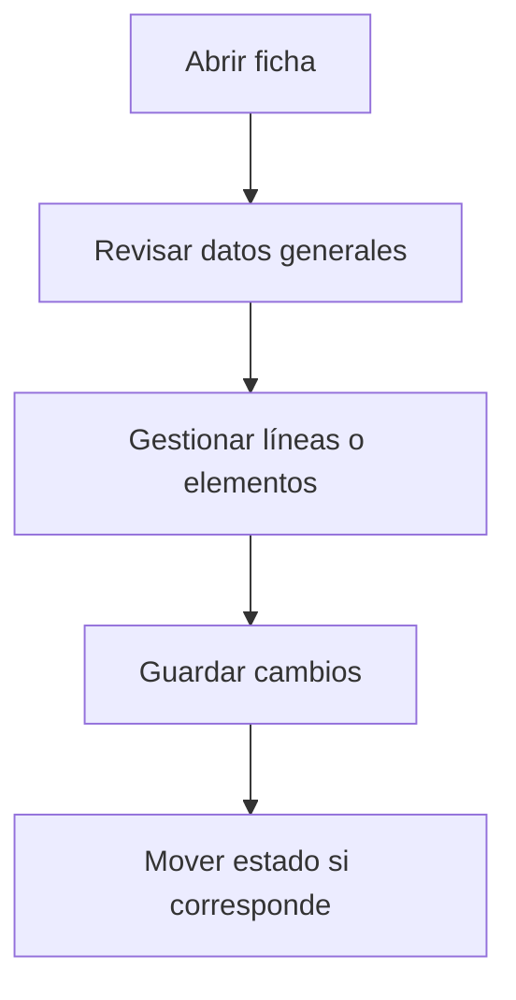

# Recepción

## Para qué sirve esta pantalla

Pantalla de gestión de la entidad.

## Acciones disponibles

- Guardar la recepción
- Añadir líneas de recepción
- Eliminar líneas
- Asociar la recepción a una o varias facturas
- Desasociar una factura
- Cerrar o abrir la recepción

## Flujo habitual

1. Revisa los datos generales de la ficha.
2. Gestiona las líneas o los elementos asociados según corresponda.
3. Guarda los cambios cuando hayáis terminado.
4. Si la ficha tiene un ciclo de vida, mueve el estado según corresponda.

## Aspectos importantes

- El comportamiento concreto de cada acción depende del estado del ciclo de vida de la entidad.
- Las acciones de creación, modificación y eliminación pueden estar bloqueadas según el estado.
- Algunos campos son de solo lectura cuando la entidad ya forma parte de un documento comercial vinculado.

## Errores frecuentes

- Si las líneas no se pueden añadir, comprueba que haya pedidos abiertos del proveedor.
- Si no se puede asociar una factura, revisa que la recepción esté cerrada y las cantidades coincidan.

## Proceso básico

