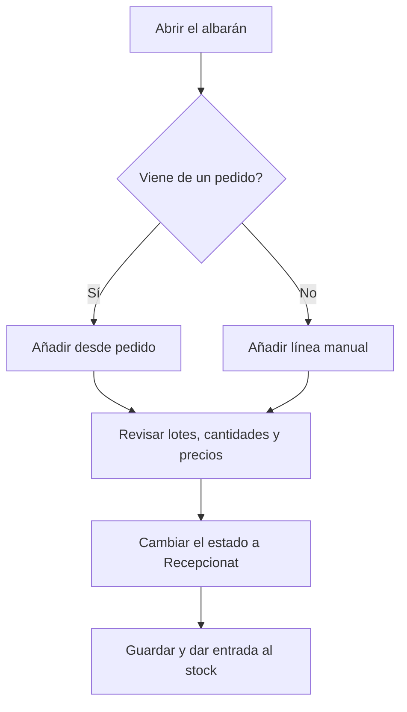

# Albarán de recepción

## Para qué sirve esta pantalla

Es la ficha de un albarán de compra: registra qué ha llegado de un proveedor, en qué cantidad, con qué medidas y a qué precio. Cuando el albarán pasa al estado «Recepcionat», el material entra en el stock. Las líneas pueden venir de los pedidos de compra pendientes del proveedor y, más adelante, el albarán se asocia a la factura de compra.

## Acciones disponibles

- Modificar la cabecera («Ejercicio», «Fecha del albarán», «Estado», «Proveedor», «Número de albarán») y guardarla con «Guardar».
- Añadir líneas desde los pedidos pendientes del proveedor con «Añadir desde pedido».
- Añadir una línea manual con «Añadir línea».
- Modificar una línea haciendo clic en la fila.
- Eliminar una línea con la cruz de la fila.
- Crear una referencia nueva desde la pestaña «Referencia» del diálogo de la línea.
- Abrir la trazabilidad del lote de una línea con el icono de árbol de la fila.
- Adjuntar o consultar documentos en la pestaña «Archivos».

## Flujo habitual

1. Abre el albarán desde la lista y escribe el «Número de albarán» que lleva el papel del proveedor.
2. Si el material viene de un pedido, pulsa «Añadir desde pedido», marca las líneas de pedido recibidas, ajusta la «Cantidad pendiente» y el «Importe», y pulsa «Añadir».
3. Si no hay pedido, pulsa «Añadir línea», elige la «Referencia de compra», rellena las medidas y la «Cantidad», y pulsa «Crear».
4. Si la referencia trabaja con lotes, elige o crea el lote en cada línea.
5. Cambia el «Estado» a «Recepcionat» y pulsa «Guardar» para dar entrada al material en el stock.
6. Adjunta el albarán escaneado en la pestaña «Archivos» si hace falta.

## Aspectos importantes

- El «Número» es interno y no se puede modificar. El «Estado» solo ofrece las transiciones permitidas desde el estado actual, definidas en «Ciclos de vida».
- Al pasar a «Recepcionat» se crea una entrada de stock en la ubicación por defecto del almacén para cada línea que aún no la tenía. Las líneas de referencias de servicio no generan stock.
- Al sacar el albarán de «Recepcionat» hacia otro estado, las entradas de stock de sus líneas se eliminan.
- Con el albarán en «Recepcionat», «Añadir desde pedido» y «Añadir línea» quedan desactivados. Las líneas que ya han entrado en el stock no muestran la cruz de eliminar.
- Al pasar a «Recepcionat», si una línea viene de un pedido ligado a una fase externa de una orden de fabricación y esa línea de pedido ya se ha recibido entera, la fase se cierra.
- Al añadir líneas desde pedido, la cantidad recibida se suma a la línea del pedido, que pasa a «Rebuda parcialment» o «Rebuda»; cuando todas las líneas están recibidas, el pedido pasa a «Rebuda». Eliminar la línea del albarán resta esa cantidad y recalcula los estados.
- En el diálogo «Selección de pedidos», el «Importe» es el precio total del grupo y se reparte entre las líneas marcadas según la cantidad. Si lo dejas vacío, las líneas entran con importe 0.
- En la línea manual, el «Formato» viene de la referencia y decide qué medidas se pueden rellenar. Para «RODO», «TUB» y «PLACA» el peso y el precio se calculan a partir de las medidas y el «Precio / kilo»; para «UNITATS», el «Precio» es «Precio unitario» × «Cantidad».
- Al elegir la referencia, el precio se propone con el precio de este proveedor para la referencia o, si no lo hay, con el precio de la referencia. La descripción se rellena con el nombre de la referencia si estaba vacía.
- Si la referencia trabaja con lotes y no indicas ninguno, la línea se asigna a un lote sin código.
- Cada vez que guardas el albarán, el precio de las líneas se actualiza como último coste de la referencia y como precio del proveedor para esa referencia; si el proveedor no tenía la referencia, se le añade.
- Después de «Guardar», la aplicación vuelve a la pantalla anterior.

## Errores frecuentes

- Si los botones para añadir líneas están desactivados, el albarán ya está en «Recepcionat». Si el ciclo de vida lo permite, devuélvelo al estado anterior, haz el cambio y vuelve a ponerlo en «Recepcionat».
- Si «Añadir desde pedido» no muestra nada, comprueba que el proveedor del albarán tenga pedidos con líneas pendientes de recibir (ni recibidas ni canceladas).
- Si aparece «Selecciona alguna línea para añadirla al albarán» o «No se pueden añadir líneas con cantidad 0», marca al menos una línea de pedido y revisa que la «Cantidad pendiente» no sea 0.
- Si la «Calculadora de peso/precio» avisa «Referencia sin formato» o «Referencia sin tipo», completa el formato y el tipo de la referencia en «Referencias de compra».
- Si aparece «El lote seleccionado no pertenece a esta referencia», elige un lote de la misma referencia.
- Si aparece «La referencia y la versión introducidas ya existen» al crear una referencia, búscala en el desplegable de la línea.
- Si la «Cantidad» da error, debe ser como mínimo 1.

## Proceso básico

```mermaid
flowchart TD
    A[Abrir el albarán] --> B{Viene de un pedido?}
    B -->|Sí| C[Añadir desde pedido]
    B -->|No| D[Añadir línea manual]
    C --> E[Revisar lotes, cantidades y precios]
    D --> E
    E --> F[Cambiar el estado a Recepcionat]
    F --> G[Guardar y dar entrada al stock]
```
