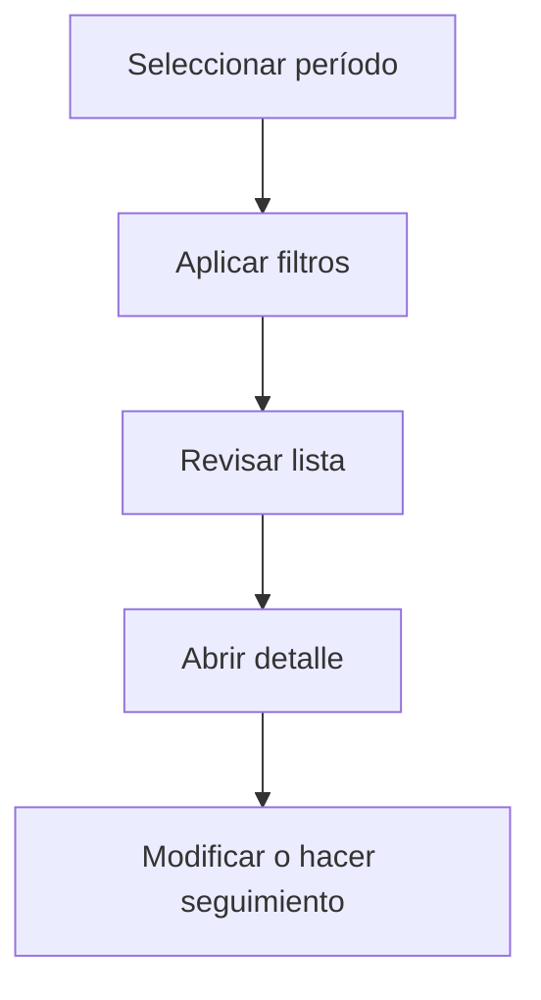

# Recepciones

## Para qué sirve esta pantalla

La pantalla de recepciones permite consultar los albaranes de recepción de mercancías en un período. Puedes filtrar por proveedor, estado o referencia, y acceder al detalle para revisar las líneas recibidas y asociarlas a una factura de compra.

## Acciones disponibles

- Seleccionar período
- Filtrar por proveedor, estado o referencia
- Crear una recepción manual
- Abrir el detalle de una recepción

## Flujo habitual

1. Selecciona el período o ejercicio que quieres consultar.
2. Aplica los filtros que necesites para reducir el volumen de resultados.
3. Revisa la lista y selecciona el elemento que quieras abrir.
4. Accede al detalle para hacer las modificaciones o el seguimiento que corresponda.

## Aspectos importantes

- El comportamiento concreto de cada acción depende del estado del ciclo de vida de la entidad.
- Las acciones de creación, modificación y eliminación pueden estar bloqueadas según el estado.
- Algunos campos son de solo lectura cuando la entidad ya forma parte de un documento comercial vinculado.

## Errores frecuentes

- Si no se muestran recepciones, comprueba que el período esté seleccionado.
- Si no se puede crear una recepción manual, comprueba que tenga un pedido asociado.

## Proceso básico

