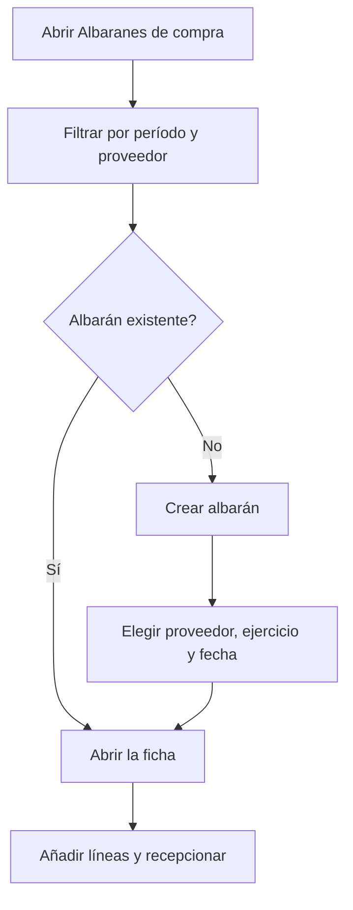

# Albaranes de compra

## Para qué sirve esta pantalla

Lista los albaranes de recepción del material y los servicios que llegan de los proveedores. Desde aquí se buscan por período y proveedor, se crea un albarán nuevo y se abre la ficha para registrar sus líneas. El albarán se sitúa entre el pedido y la factura: `pedido de compra -> albarán de recepción -> stock -> factura de compra`.

## Acciones disponibles

- Filtrar por «Período» y «Proveedor» y aplicar el filtro con el botón «Filtrar»; «Limpiar filtros» vuelve al año en curso sin proveedor.
- Crear un albarán con el botón «+» («Crear nuevo»): se abre el diálogo «Crear albarán».
- Abrir un albarán haciendo clic en la fila.
- Eliminar un albarán con la cruz de la fila, solo mientras está en el estado inicial.

## Flujo habitual

1. Abre «Albaranes de compra». Por defecto se muestran los albaranes del año en curso.
2. Si hace falta, elige un proveedor en el filtro y pulsa «Filtrar».
3. Para registrar una entrega, pulsa «+», elige el «Proveedor», revisa el «Ejercicio» y la «Fecha», y pulsa «Crear».
4. Se abre la ficha del nuevo albarán: añade las líneas (consulta la ayuda de la ficha).
5. Para consultar uno existente, haz clic en la fila.

## Aspectos importantes

- El «Período» es obligatorio: sin un período completo no se hace la búsqueda.
- La columna «Número» es el número interno, que se asigna automáticamente con el contador del ejercicio elegido. La columna «Número de albarán» es el número que figura en el albarán del proveedor.
- Un albarán nuevo se crea con el estado inicial del ciclo de vida de los albaranes, configurado en «Ciclos de vida».
- Al crear el albarán, el «Ejercicio» se propone con el ejercicio que lleva el nombre del año en curso.
- La cruz de eliminar solo aparece en los albaranes que están en el estado inicial. La eliminación es definitiva y borra también las líneas.
- Eliminar todo el albarán no resta las cantidades recibidas de los pedidos. Si el albarán tiene líneas que vienen de un pedido, elimina primero esas líneas desde la ficha: al eliminar una línea, la cantidad recibida se resta del pedido.
- El color de la etiqueta de la columna «Estado» es el del estado en el ciclo de vida.

## Errores frecuentes

- Si aparece «Filtro no válido» con «Selecciona un período», elige una fecha de inicio y una de fin en el filtro «Período».
- Si no se puede crear el albarán porque el ejercicio no existe o hay un error en el contador, revisa que el ejercicio elegido esté bien configurado.
- Si al crear aparece que el ciclo de vida no tiene un estado inicial, hay que definirlo en «Ciclos de vida».
- Si no ves la cruz para eliminar un albarán, es porque ya no está en el estado inicial.

## Proceso básico

```mermaid
flowchart TD
    A[Abrir Albaranes de compra] --> B[Filtrar por período y proveedor]
    B --> C{Albarán existente?}
    C -->|Sí| D[Abrir la ficha]
    C -->|No| E[Crear albarán]
    E --> F[Elegir proveedor, ejercicio y fecha]
    F --> D
    D --> G[Añadir líneas y recepcionar]
```
