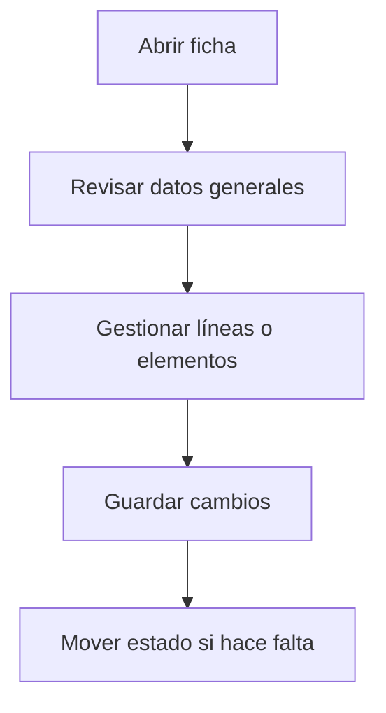

# Proveedor

## Para qué sirve esta pantalla

Pantalla de gestión de la entidad.

## Acciones disponibles

- Guardar los cambios de la ficha
- Añadir y editar contactos
- Añadir direcciones de entrega y facturación
- Gestionar tarifas de compra
- Gestionar descuentos por artículo
- Seleccionar el tipo de proveedor

## Flujo habitual

1. Revisa los datos generales de la ficha.
2. Gestiona las líneas o los elementos asociados según haga falta.
3. Guarda los cambios cuando hayáis acabado.
4. Si la ficha tiene un ciclo de vida, mueve el estado según corresponda.

## Aspectos importantes

- El comportamiento concreto de cada acción depende del estado del ciclo de vida de la entidad.
- Las acciones de creación, modificación y eliminación pueden estar bloqueadas según el estado.
- Algunos campos son de solo lectura cuando la entidad ya forma parte de un documento comercial vinculado.

## Errores frecuentes

- Si no se puede guardar la ficha, comprueba que el NIF no esté duplicado en otro proveedor.
- Si las tarifas no se cargan, revisa la conexión con el servicio de precios.

## Proceso básico

