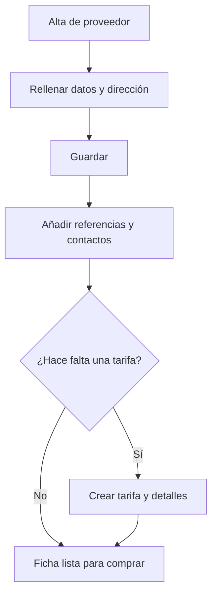

# Proveedor

## Para qué sirve esta pantalla

Es la ficha de un proveedor: datos fiscales y de contacto, dirección, forma de pago y las condiciones de compra. Las referencias y tarifas que defines aquí se aprovechan después al crear pedidos de compra (precio, descripción y fecha prevista de cada línea) y al calcular servicios externos y transportes en los presupuestos y pedidos de venta. La lista y los tipos de proveedor se gestionan en la pantalla «Proveedores».

## Acciones disponibles

- Rellenar o modificar los datos en la pestaña «Proveedor» y guardarlos con «Guardar», en la cabecera de la pantalla.
- Buscar la dirección con «Buscar ubicación» para rellenar automáticamente los campos de la dirección y las coordenadas.
- Consultar las coordenadas y la distancia en el apartado plegable «Coordenadas y distancia», y abrirlas con «Ver en el mapa».
- Añadir, editar o eliminar en la pestaña «Referencias» las referencias de compra que vende este proveedor, con su código, descripción, precio y días de suministro.
- Añadir, editar o eliminar personas de contacto en la pestaña «Contactos».
- Crear, editar, duplicar o eliminar tarifas en la pestaña «Tarifas de compra», y definir sus detalles por referencia.
- Crear y mantener tarifas de transporte en la pestaña «Tarifas de transporte» (solo para proveedores de tipo «Logistica»).

## Flujo habitual

1. Desde «Proveedores», pulsa «+» para abrir la pantalla «Alta de proveedor».
2. Rellena «Nombre comercial», «Nombre fiscal», «NIF/CIF» y «Tipo de proveedor».
3. Elige el «País» y usa «Buscar ubicación» para rellenar la dirección; revisa «Dirección», «Ciudad», «Provincia» y «Código postal».
4. Rellena «Teléfono», «Forma de pago» y «Número de cuenta», y pulsa «Guardar».
5. Una vez creado, aparecen las demás pestañas: añade en «Referencias» lo que compras a este proveedor y en «Contactos» las personas de referencia.
6. Si hace falta, crea en «Tarifas de compra» una tarifa con sus fechas y añádele los detalles.

## Aspectos importantes

- Las pestañas «Referencias», «Contactos» y «Tarifas de compra» solo aparecen después de guardar el proveedor por primera vez.
- Son obligatorios: «Nombre comercial», «Nombre fiscal», «NIF/CIF» (hasta 15 caracteres), «Tipo de proveedor», «Dirección», «Ciudad», «Provincia», «Código postal», «Teléfono», «Forma de pago» y «Número de cuenta» (hasta 35 caracteres).
- No puede haber dos proveedores con el mismo nombre comercial.
- «Buscar ubicación» solo se activa después de elegir el «País».
- Al guardar, si no hay coordenadas, la aplicación intenta obtenerlas a partir de la dirección, y calcula la «Distancia desde la sede (km)». Este campo no se puede editar.
- En «Referencias», «Precio del proveedor» y «Días de suministro» son los valores que se proponen al añadir esa referencia a un pedido de compra del proveedor: el precio, la descripción y la fecha prevista (hoy más los días de suministro). Una misma referencia solo se puede añadir una vez por proveedor.
- Cuando se guarda un albarán de recepción de este proveedor, el «Precio del proveedor» de cada referencia se actualiza con el precio del albarán; si la referencia todavía no estaba, se añade automáticamente.
- En «Tarifas de compra», haz clic en una tarifa para ver sus «Detalles» en la tabla inferior. El botón «+» de los detalles solo se activa con una tarifa seleccionada. Cada detalle indica la «Referencia», el «Tipo de cálculo» («Unidades», «Volumen» o «Peso»), el tramo «Desde» y «Hasta» y el «Precio (€)».
- La tarifa de compra vigente en una fecha decide si los servicios externos de este proveedor se calculan por unidades, volumen o peso en los presupuestos y pedidos de venta.
- Las tarifas de compra de un mismo proveedor no se pueden solapar en fechas. «Duplicar» crea una tarifa nueva con el nombre y las fechas que indiques y copia todos sus detalles.
- La pestaña «Tarifas de transporte» solo se muestra si el tipo del proveedor se llama exactamente «Logistica». Cada tarifa tiene fechas de validez y detalles por tramos de peso, volumen y distancia con su precio.
- «Notas para los pedidos de compra» es un campo de texto separado de las «Observaciones» generales.

## Errores frecuentes

- Si al crear el proveedor aparece «Proveedor ... existente», ya hay un proveedor con ese nombre comercial: búscalo en la lista.
- Si el formulario no se guarda, revisa los mensajes bajo los campos obligatorios, sobre todo la dirección, la forma de pago y el número de cuenta.
- Si no puedes escribir en «Buscar ubicación», elige antes el «País».
- Si al añadir una referencia aparece «La referencia ya existe», esa referencia ya está vinculada al proveedor: edita la fila existente.
- Si no puedes guardar o duplicar una tarifa de compra, revisa que las fechas no se solapen con otra tarifa del mismo proveedor y que la fecha de fin no sea anterior a la de inicio.
- Si no ves la pestaña «Tarifas de transporte», comprueba que el tipo del proveedor sea «Logistica».

## Proceso básico

```mermaid
flowchart TD
    A[Alta de proveedor] --> B[Rellenar datos y dirección]
    B --> C[Guardar]
    C --> D[Añadir referencias y contactos]
    D --> E{¿Hace falta una tarifa?}
    E -->|Sí| F[Crear tarifa y detalles]
    E -->|No| G[Ficha lista para comprar]
    F --> G
```
