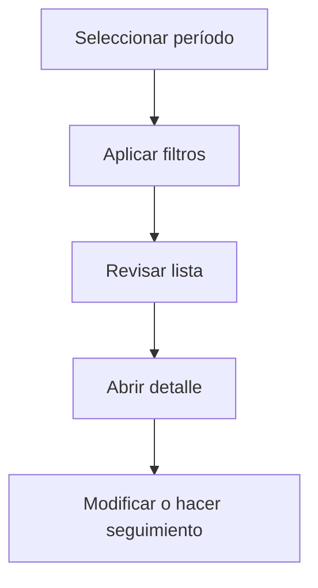

# Proveedores

## Para qué sirve esta pantalla

La pantalla de proveedores permite consultar el directorio de proveedores activos. Puedes filtrar por tipo de proveedor, buscar por nombre o NIF, y acceder a la ficha de cada proveedor para gestionar contactos, direcciones, condiciones comerciales y tarifas.

## Acciones disponibles

- Filtrar por tipo de proveedor
- Buscar por nombre o NIF
- Crear un proveedor nuevo
- Abrir el detalle de un proveedor
- Eliminar un proveedor

## Flujo habitual

1. Selecciona el período o ejercicio que quieres consultar.
2. Aplica los filtros que necesites para reducir el volumen de resultados.
3. Revisa la lista y selecciona el elemento que quieras abrir.
4. Accede al detalle para hacer las modificaciones o el seguimiento que haga falta.

## Aspectos importantes

- El comportamiento concreto de cada acción depende del estado del ciclo de vida de la entidad.
- Las acciones de creación, modificación y eliminación pueden estar bloqueadas según el estado.
- Algunos campos son de solo lectura cuando la entidad ya forma parte de un documento comercial vinculado.

## Errores frecuentes

- Si no se muestran proveedores, comprueba que el filtro de tipo no esté vacío.
- Si no se puede eliminar un proveedor, revisa si tiene pedidos, recibos o facturas asociadas.

## Proceso básico

