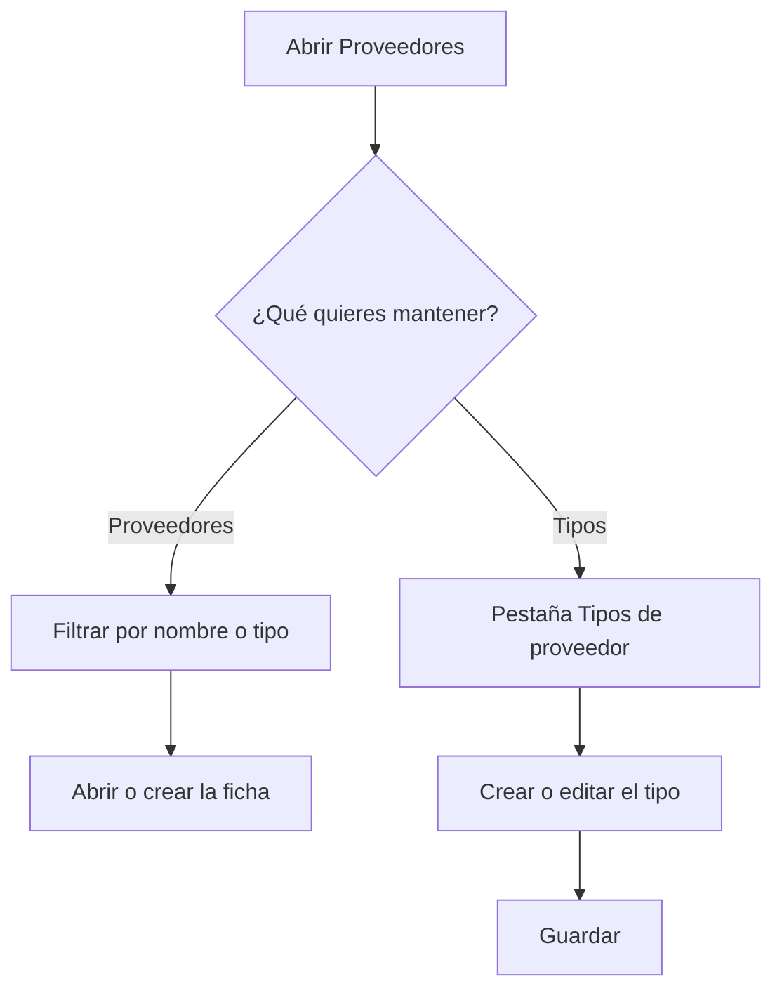

# Proveedores

## Para qué sirve esta pantalla

Es el directorio de proveedores de la empresa y, en la misma pantalla, el catálogo de tipos de proveedor. Desde aquí localizas un proveedor para abrir su ficha, das de alta uno nuevo o mantienes la clasificación por tipos. El proveedor es la base de todo el circuito de compras: pedido de compra -> albarán de recepción -> factura de compra.

## Acciones disponibles

- Buscar proveedores con los filtros «Nombre» (busca en el nombre comercial) y «Tipo». La lista se filtra a medida que escribes o eliges.
- Abrir la ficha de un proveedor haciendo clic en la fila.
- Crear un proveedor con el botón «+» («Crear nuevo») de la pestaña «Proveedores».
- Eliminar un proveedor con la «X» de la fila, tras confirmarlo.
- Cambiar a la pestaña «Tipos de proveedor» para ver el catálogo de tipos.
- Crear un tipo con el botón «+» de esa pestaña, o editarlo haciendo clic en la fila: se abre un diálogo con «Nombre» y «Descripción» y el botón «Guardar».
- Eliminar un tipo de proveedor con la «X» de la fila, tras confirmarlo.

## Flujo habitual

1. Abre la pantalla «Proveedores».
2. Escribe parte del nombre comercial en «Nombre» o elige un «Tipo» para acotar la lista.
3. Haz clic en la fila para abrir la ficha del proveedor.
4. Si no existe, pulsa «+» y rellena la ficha del proveedor nuevo.
5. Si falta una clasificación, ve a «Tipos de proveedor», pulsa «+», rellena «Nombre» y «Descripción» y pulsa «Guardar».

## Aspectos importantes

- El botón «+» crea un proveedor o un tipo de proveedor según la pestaña activa.
- La lista muestra «Nombre comercial», «Nombre fiscal», el CIF, «Teléfono» y «Tipo».
- Cada proveedor debe tener un tipo: el campo «Tipo de proveedor» de la ficha es obligatorio. Crea los tipos antes de dar de alta proveedores.
- El tipo llamado exactamente «Logistica» tiene un uso especial: los proveedores de ese tipo muestran la pestaña «Tarifas de transporte» en su ficha y son los que se pueden elegir como transportistas en los presupuestos y en los pedidos de venta. No cambies el nombre de ese tipo.
- En el diálogo de tipo, «Nombre» y «Descripción» son obligatorios y admiten hasta 250 caracteres.
- Eliminar un proveedor o un tipo es definitivo. La aplicación no comprueba antes si el proveedor tiene pedidos, albaranes o facturas, ni si el tipo tiene proveedores asignados. Elimina solo registros que no se hayan usado; si un tipo tiene proveedores, cámbialos antes de tipo.

## Errores frecuentes

- Si no encuentras un proveedor, comprueba que el filtro «Tipo» esté vacío y que busques por el nombre comercial, no por el nombre fiscal.
- Si al crear un tipo aparece «La entidad ya existe», ya hay un tipo con ese nombre.
- Si el diálogo de tipo no se guarda, revisa que «Nombre» y «Descripción» estén informados.
- Si un proveedor de transporte no aparece en los presupuestos o en los pedidos de venta, comprueba que su tipo sea «Logistica».
- Si el botón «+» abre una pantalla que no esperabas, revisa qué pestaña tienes activa.

## Proceso básico

```mermaid
flowchart TD
    A[Abrir Proveedores] --> B{¿Qué quieres mantener?}
    B -->|Proveedores| C[Filtrar por nombre o tipo]
    C --> D[Abrir o crear la ficha]
    B -->|Tipos| E[Pestaña Tipos de proveedor]
    E --> F[Crear o editar el tipo]
    F --> G[Guardar]
```
