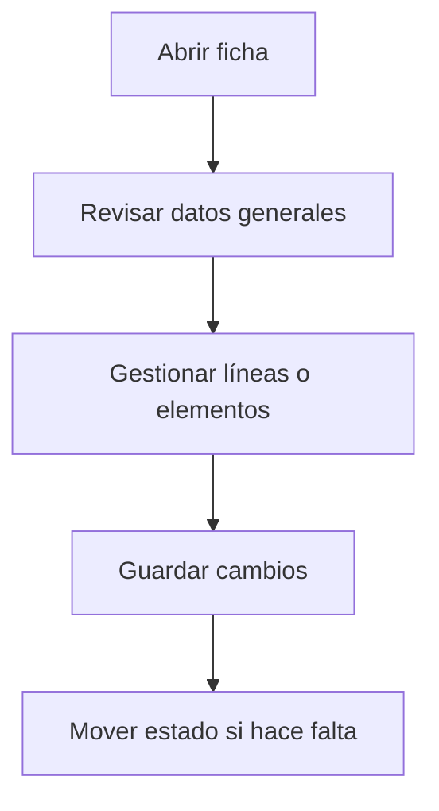

# Tipo de proveedor

## Para qué sirve esta pantalla

La pantalla de tipo de proveedor permite definir y mantener los tipos o categorías que clasifican a los proveedores (por ejemplo: materias primas, servicios, logística, equipamientos). Es un catálogo auxiliar que alimenta el campo 'tipo' en la ficha de proveedor.

## Acciones disponibles

- Crear un tipo de proveedor
- Editar un tipo existente
- Eliminar un tipo de proveedor

## Flujo habitual

1. Revisa los datos generales de la ficha.
2. Gestiona las líneas o los elementos asociados según haga falta.
3. Guarda los cambios cuando hayáis acabado.
4. Si la ficha tiene un ciclo de vida, mueve el estado según corresponda.

## Aspectos importantes

- El comportamiento concreto de cada acción depende del estado del ciclo de vida de la entidad.
- Las acciones de creación, modificación y eliminación pueden estar bloqueadas según el estado.
- Algunos campos son de solo lectura cuando la entidad ya forma parte de un documento comercial vinculado.

## Errores frecuentes

- Si no se muestran datos, comprueba que el filtro esté bien informado.
- Si la operación falla, revisa que todos los datos obligatorios estén informados.

## Proceso básico

