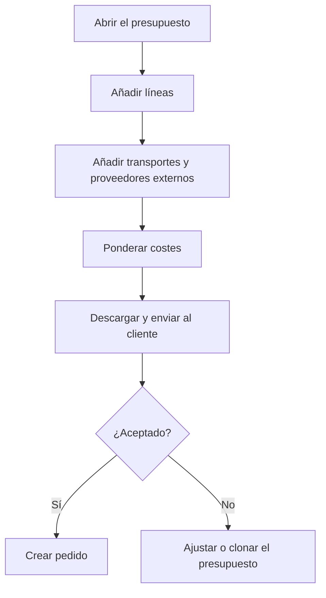

# Presupuesto

## Para qué sirve esta pantalla

Es la ficha de un presupuesto de venta. En ella preparas la oferta para el cliente: las líneas con referencia, costes, márgenes y precio, los transportes y los servicios externos. Cuando el cliente la acepta, desde aquí generas el pedido (presupuesto -> pedido -> albarán -> factura) y descargas el documento para enviarlo.

## Acciones disponibles

- Modificar la cabecera («Fecha de alta», «Fecha de aceptación», «Estado», «Cliente», «Días naturales de entrega», «Notas internas») y guardarla con «Guardar».
- Abrir el menú de la flecha de «Guardar» para:
  - «Descargar»: genera el presupuesto en formato Word.
  - «Imprimir PDF»: genera el presupuesto en PDF.
  - «Crear pedido»: genera el pedido de venta a partir del presupuesto.
  - «Clonar presupuesto»: crea un presupuesto nuevo con las mismas líneas.
- Abrir la ficha del cliente con la lupa del campo «Cliente».
- Pestaña «Detalle»: añadir líneas con «Añadir línea», editarlas haciendo clic en la fila, eliminarlas con la «X» y repartir costes con «Ponderar costes».
- Pestaña «Transporte»: añadir transportes con «Añadir transporte», editarlos y eliminarlos.
- Pestaña «Servicios externos»: elegir el «Proveedor» de cada servicio externo.

## Flujo habitual

1. Revisa el «Cliente» y los «Días naturales de entrega».
2. En «Detalle», pulsa «Añadir línea», elige la «Referencia» y, si la tiene, la «Ruta de fabricación»; ajusta «Cantidad», márgenes y «Descuento», y pulsa «Guardar».
3. Si hay servicios externos, elige su «Proveedor» en «Servicios externos».
4. Si el envío se cobra, añádelo en «Transporte» con el transportista y la tarifa.
5. Pulsa «Ponderar costes» para que el transporte y los servicios externos se repartan entre las líneas.
6. Descarga el documento con «Descargar» o «Imprimir PDF» y envíalo al cliente.
7. Cuando lo acepte, elige «Crear pedido»: se abre el pedido nuevo.

## Aspectos importantes

- «Presupuesto» (el número) y «Pedido» son de solo lectura. «Pedido» muestra el número del pedido creado desde este presupuesto.
- El desplegable «Estado» solo ofrece los cambios de estado permitidos desde el estado actual, definidos en «Ciclos de vida».
- Al pasar de «Pendent d'acceptar» (pendiente de aceptar) a «Acceptat» (aceptado), la «Fecha de aceptación» se rellena con la fecha del momento. Los nombres de los estados se muestran tal como están configurados en el ciclo de vida.
- «Guardar» guarda la cabecera y vuelve a la pantalla anterior. Las líneas, los transportes y los servicios externos se guardan en el momento, cada uno desde su diálogo.
- «Crear pedido» crea un pedido con fecha de hoy, en el ejercicio de la fecha actual y con fecha prevista de hoy más los «Días naturales de entrega». Copia las líneas, los transportes y los servicios externos, y pone el presupuesto en «Acceptat» con la fecha de aceptación de hoy. Usa el cliente y los días de entrega que hay en pantalla, aunque no los hayas guardado.
- Un presupuesto solo puede tener un pedido. Una vez creado, desaparecen «Añadir línea», «Ponderar costes», «Añadir transporte» y los iconos para eliminar líneas y transportes.
- En la línea, la «Referencia» muestra las referencias del cliente del presupuesto y las que no tienen cliente. Si la referencia tiene una sola ruta de fabricación activa, se elige automáticamente y se calculan sus costes de producción, material, servicio y transporte para la cantidad indicada.
- «Beneficio» y «Total» se calculan solos a partir de los costes, los porcentajes de beneficio y el «Descuento». El «Precio unitario» se puede ajustar a mano.
- La pestaña «Márgenes» de la línea muestra el beneficio por fase de la ruta. «Aplicar» copia el «Beneficio ponderado» al «% de beneficio de producción».
- Al guardar una línea con ruta, el sistema suma su peso al presupuesto y añade a «Servicios externos» los servicios de las fases externas de la ruta.
- En «Servicios externos», al elegir el proveedor, el precio se calcula con su tarifa (por volumen, peso o unidades) y se guarda automáticamente.
- En el transporte, «Envío a cliente final» toma la distancia de la dirección principal del cliente. La «Tarifa de transporte» solo ofrece tarifas vigentes del transportista compatibles con el peso, el volumen y la distancia, ordenadas de más barata a más cara y con la más barata marcada como «Mejor precio».
- «Ponderar costes» reparte el coste de transporte entre las líneas según el peso de cada una, reparte los servicios externos según la tarifa vigente del proveedor en la fecha del presupuesto y recalcula el coste, el precio unitario y el total de cada línea. Si habías ajustado precios a mano, revísalos después.
- «Clonar presupuesto» crea un presupuesto con número nuevo, fecha de hoy y estado inicial, con el mismo cliente, líneas, transportes y servicios externos, y lo abre.
- Las «Notas automáticas» son de solo lectura; en ellas aparece, por ejemplo, el aviso de rechazo automático de un presupuesto pendiente demasiado antiguo.
- «Descargar» e «Imprimir PDF» generan el documento en el idioma configurado en la ficha del cliente.

## Errores frecuentes

- Si «Crear pedido» avisa «Este documento ya tiene un documento asociado», el presupuesto ya tiene pedido: lo encontrarás en el campo «Pedido».
- Si «Crear pedido» falla con «El cliente no es válido para crear una factura...» o «El cliente no tiene direcciones dadas de alta...», completa «Nombre fiscal», «NIF/CIF», «Número de cuenta» y la dirección en la ficha del cliente.
- Si falla con «No se ha encontrado ningún ejercicio para la fecha actual», hay que crear el ejercicio del año en «Ejercicios».
- Si falla porque la sede no es válida para crear una factura, revisa los datos de facturación del centro de la empresa (dirección, ciudad, código postal, provincia, país y NIF).
- Si «Ponderar costes» devuelve «No se han podido ponderar los costes.», comprueba que el presupuesto tenga líneas.
- Si una línea no recibe coste de transporte al ponderar, probablemente no tiene peso: el peso solo se calcula para líneas con ruta de fabricación y referencia con tipo de material.
- Si no puedes elegir una «Tarifa de transporte», elige primero el transportista y comprueba que tenga tarifas vigentes para el peso, el volumen y la distancia.
- Si la línea no se guarda, revisa que la «Cantidad» sea 1 o más.

## Proceso básico

