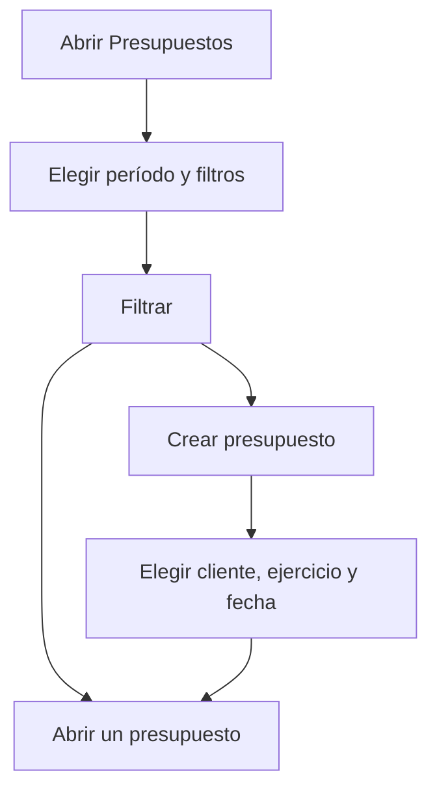

# Presupuestos

## Para qué sirve esta pantalla

Muestra los presupuestos de venta de un período y es donde se crean los nuevos. El presupuesto es el primer paso del flujo comercial (presupuesto -> pedido -> albarán -> factura): cuando el cliente lo acepta, desde la ficha del presupuesto se genera el pedido.

## Acciones disponibles

- Elegir el «Período» por fecha del presupuesto; por defecto es el año en curso.
- Filtrar por «Cliente» y por uno o más valores de «Estado».
- Aplicar los filtros con «Filtrar».
- Volver a los filtros iniciales con «Limpiar»: borra cliente y estados y vuelve a poner el año en curso.
- Crear un presupuesto con el botón «+» («Crear nuevo»), que abre el diálogo «Crear presupuesto».
- Abrir un presupuesto haciendo clic en la fila.
- Eliminar un presupuesto con el icono de papelera («Eliminar»), solo visible en los presupuestos que están en el estado inicial.
- Adaptar las columnas y guardar vistas con el icono de engranaje («Configuración de la vista»).

## Flujo habitual

1. Abre «Presupuestos»: se cargan los del año en curso.
2. Si hace falta, cambia el «Período», elige un «Cliente» o unos estados y pulsa «Filtrar».
3. Revisa «Número», «Fecha», «Cliente», «Estado», «Fecha de aceptación» y «Días de entrega».
4. Para crear uno, pulsa «+», elige «Cliente», «Ejercicio» y «Fecha», y pulsa «Guardar».
5. El sistema crea el presupuesto y abre su ficha para añadir las líneas.

## Aspectos importantes

- El «Período» es obligatorio: sin una fecha de inicio y una de fin, la lista no se carga.
- El número del presupuesto lo asigna el sistema a partir del contador de presupuestos del ejercicio elegido. Los ejercicios se gestionan en «Ejercicios».
- En el diálogo de creación, el «Ejercicio» propuesto es el que lleva el nombre del año actual.
- Todo presupuesto nuevo entra en el estado inicial del ciclo de vida de presupuestos, configurado en «Ciclos de vida».
- Los presupuestos que siguen en el estado «Pendent d'acceptar» (pendiente de aceptar) 30 días después de su fecha pasan automáticamente a «Rebutjat» (rechazado), con una nota automática que lo indica. Los nombres de los estados se muestran tal como están configurados en el ciclo de vida.
- Solo se puede eliminar un presupuesto en el estado inicial y sin pedido asociado. La eliminación es definitiva.
- Los filtros y las columnas se guardan en tu vista de la tabla, de modo que al volver a la pantalla recuperas el contexto de trabajo.

## Errores frecuentes

- Si aparece «Filtro no válido» o «Selecciona un período», elige una fecha de inicio y una de fin en el «Período».
- Si no ves la papelera en un presupuesto, es porque ya no está en el estado inicial.
- Si al eliminar aparece «No se puede eliminar» con «El presupuesto tiene asociado el pedido ...», el presupuesto ya se ha convertido en pedido y debe conservarse.
- Si la creación falla con «Error al crear el contador» o «El ciclo de vida 'Budget' no tiene un estado inicial», revisa el ejercicio en «Ejercicios» o el estado inicial en «Ciclos de vida».
- Si «Guardar» no hace nada en el diálogo, revisa que «Cliente», «Ejercicio» y «Fecha» estén informados.

## Proceso básico

