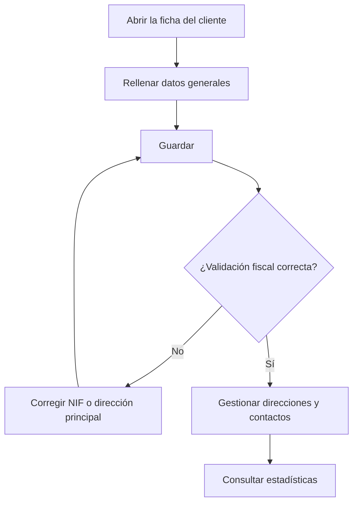

# Cliente

## Para qué sirve esta pantalla

Es la ficha de un cliente: en ella mantienes los datos comerciales y fiscales, los contactos, las direcciones y un resumen de la actividad del año. Estos datos se copian a los presupuestos, pedidos, albaranes y facturas, y los datos fiscales se validan antes de poder facturar.

Cuando se entra desde el botón «+» de «Clientes», la pantalla aparece con el título «Alta de cliente» y solo muestra la pestaña de datos generales.

## Acciones disponibles

- Rellenar o modificar los datos generales en la pestaña «Clientes» y guardarlos con «Guardar», en la cabecera.
- Gestionar las personas de contacto en la pestaña «Contactos»: añadirlas con «+», editarlas haciendo clic en la fila y eliminarlas con la papelera.
- Gestionar las direcciones en la pestaña «Direcciones»: añadir, editar, marcar una como «Principal» o «Desactivada» y eliminarlas.
- Consultar la actividad del año en la pestaña «Estadísticas».

## Flujo habitual

1. Rellena «Nombre comercial», «Nombre fiscal», «Tipo de cliente», «NIF/CIF» y «Número de cuenta».
2. Elige el «Idioma» de los documentos del cliente y, si hace falta, la «Forma de pago».
3. Pulsa «Guardar».
4. En «Direcciones», pulsa «+», informa «Nombre», «País», «Dirección», «Ciudad», «Provincia» y «Código postal», y pulsa «Guardar».
5. En «Contactos», añade las personas de contacto con «Nombre», «Apellidos», «Correo electrónico» y «Teléfono».
6. Consulta «Estadísticas» para ver presupuestos y facturación del año.

## Aspectos importantes

- Campos obligatorios del formulario: «Nombre comercial», «Nombre fiscal», «Tipo de cliente», «NIF/CIF» y «Número de cuenta».
- Al guardar, el sistema valida los datos fiscales: el «NIF/CIF» debe ser un NIF o CIF español válido y el cliente debe tener una dirección principal con país, código postal, ciudad y dirección informados. Si alguna condición falla, no se guarda nada.
- No puede haber dos clientes con el mismo nombre comercial.
- Las pestañas «Contactos», «Direcciones» y «Estadísticas» solo aparecen cuando el cliente ya existe.
- El «Idioma» del cliente es el idioma en que se generan sus documentos: presupuesto, pedido, albarán y factura.
- La primera dirección activa que añades queda marcada como principal automáticamente. Si ninguna dirección está marcada como principal, se usa la primera dirección activa.
- Al guardar una dirección, el sistema calcula sus coordenadas y la distancia desde el centro de la empresa. Esta distancia se usa para proponer tarifas de transporte en los presupuestos.
- En «Contactos», la casilla «Predeterminado» marca el contacto principal del cliente.
- «Estadísticas» muestra datos del año natural en curso: número de presupuestos, aceptados y rechazados, número de facturas, total facturado sin impuestos y un gráfico de facturación mensual. «Rechazados» cuenta todos los presupuestos sin fecha de aceptación, también los que aún están pendientes.
- Eliminar un contacto o una dirección es definitivo; para dejar de usar una dirección sin perderla, márcala como «Desactivada».

## Errores frecuentes

- Si aparece «CIF/NIF inválido», revisa el formato del «NIF/CIF».
- Si aparece «El cliente no tiene direcciones dadas de alta. Por favor, cree una dirección.», el cliente no tiene ninguna dirección activa. En un cliente existente, añade una en «Direcciones» y vuelve a guardar. En un alta nueva, la pestaña «Direcciones» todavía no es visible; si el alta queda bloqueada por este mensaje, consulta al administrador.
- Si aparece «La dirección fiscal principal del cliente está incompleta...», completa país, código postal, ciudad y dirección de la dirección principal.
- Si aparece «El cliente no es válido para crear una factura...», revisa «Nombre fiscal», «Número de cuenta» y «NIF/CIF».
- Si el alta falla porque el cliente ya existe, ya hay un cliente con ese nombre comercial: búscalo en «Clientes».
- Si una dirección no se guarda, revisa los campos obligatorios: nombre, país, dirección, ciudad, provincia y código postal.

## Proceso básico

