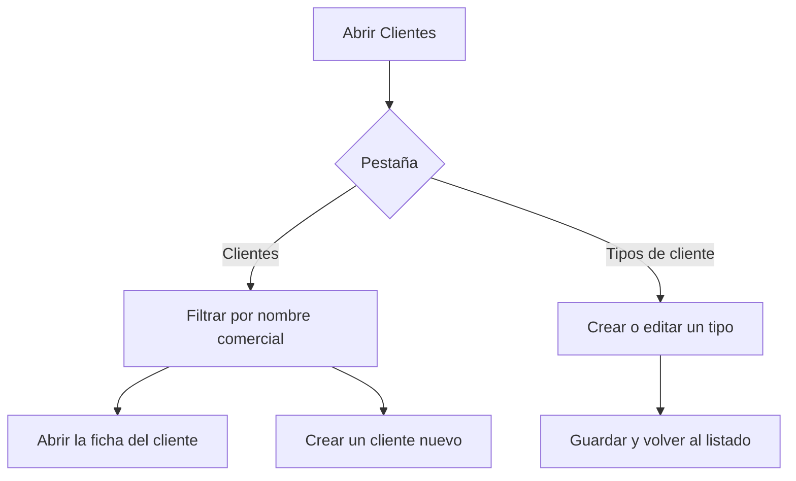

# Clientes

## Para qué sirve esta pantalla

Es el listado de clientes de ventas y el punto de partida para abrir o dar de alta la ficha de un cliente. El cliente es la base de todo el flujo comercial (presupuesto -> pedido -> albarán -> factura): cada documento de venta se crea para un cliente concreto.

La pantalla tiene dos pestañas: «Clientes», con el listado de clientes, y «Tipos de cliente», donde se mantiene el catálogo de tipos que sirve para clasificarlos.

## Acciones disponibles

- Buscar un cliente por «Nombre comercial» con el filtro de la cabecera; la lista se filtra mientras escribes.
- Limpiar el filtro con «Limpiar».
- Crear un cliente nuevo con el botón «+» («Crear nuevo»): se abre una ficha de cliente vacía.
- Abrir la ficha de un cliente haciendo clic en la fila.
- Eliminar un cliente con el icono de papelera («Eliminar») de la fila, tras confirmarlo.
- Cambiar a la pestaña «Tipos de cliente» para consultar, crear, editar o eliminar tipos.
- Adaptar las columnas y guardar vistas con el icono de engranaje («Configuración de la vista»).

## Flujo habitual

1. Abre «Clientes» y escribe parte del nombre comercial en el filtro.
2. Revisa en la tabla el «Nombre fiscal», el «CIF» y el «Tipo» del cliente.
3. Haz clic en la fila para abrir la ficha y revisar sus datos, contactos y direcciones.
4. Si el cliente no existe, pulsa «+» y rellena la ficha (consulta la ayuda de la ficha de cliente).
5. Si falta un tipo de cliente, ve a «Tipos de cliente», pulsa «+», informa «Nombre» y «Descripción» y pulsa «Guardar».

## Aspectos importantes

- El filtro solo busca por el nombre comercial, no por el nombre fiscal ni por el CIF.
- El botón «+» crea un cliente o un tipo de cliente según la pestaña activa.
- Tipos de cliente: cada tipo tiene «Nombre» y «Descripción», ambos obligatorios (máximo 250 caracteres). No se puede crear un tipo con un nombre que ya existe. Al guardar, la pantalla vuelve al listado.
- Todos los clientes deben tener un tipo: en la ficha, el campo «Tipo de cliente» es obligatorio y sus opciones salen de esta pestaña.
- La eliminación de un cliente es definitiva, no una baja: también se borran sus contactos y direcciones. Elimina solo clientes dados de alta por error y sin documentos de venta.
- La eliminación de un tipo de cliente también es definitiva y puede arrastrar a los clientes que lo tienen asignado. Antes de eliminar un tipo, cambia el tipo de sus clientes.
- La columna «Desactivado» se muestra en la tabla, pero la ficha de cliente no permite cambiarla.

## Errores frecuentes

- Si no encuentras un cliente, revisa el filtro: solo busca dentro del nombre comercial. Pulsa «Limpiar» y vuelve a intentarlo.
- Si al guardar un tipo nuevo aparece «La entidad ya existe», ya hay un tipo con ese nombre.
- Si «+» abre una pantalla distinta de la esperada, revisa qué pestaña tienes activa.
- Si no puedes eliminar un cliente o un tipo, es probable que tenga documentos o clientes relacionados; revísalos antes de volver a intentarlo.

## Proceso básico

